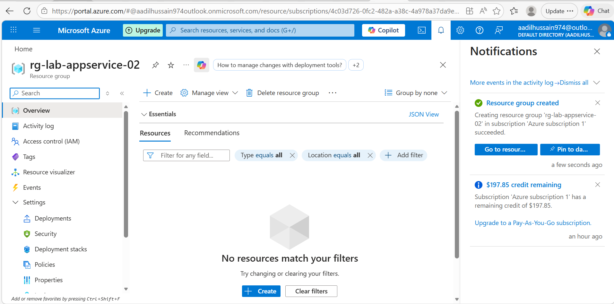
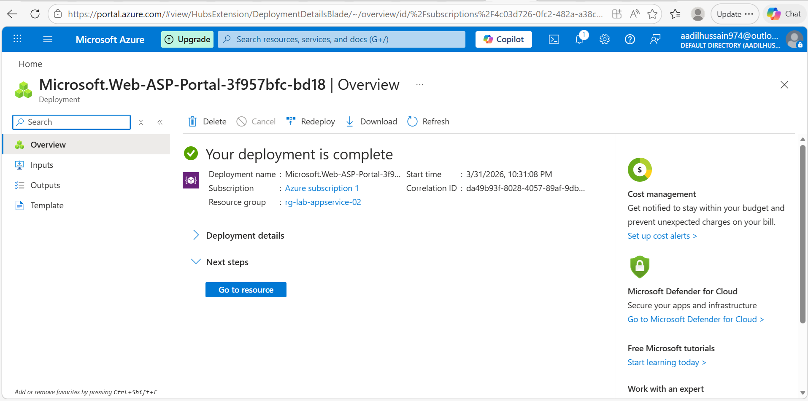
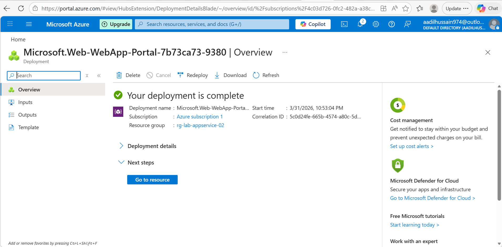
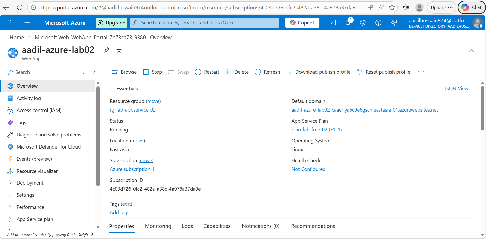
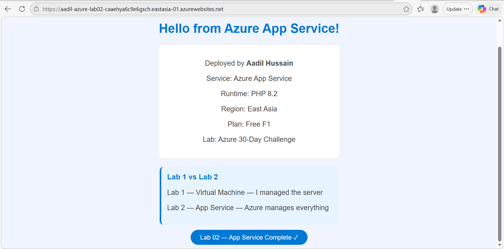
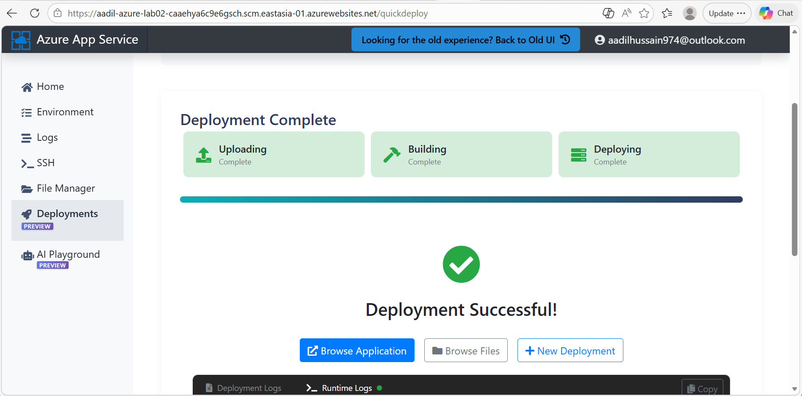
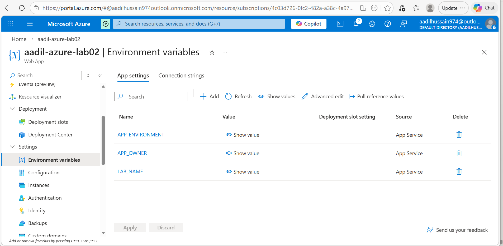
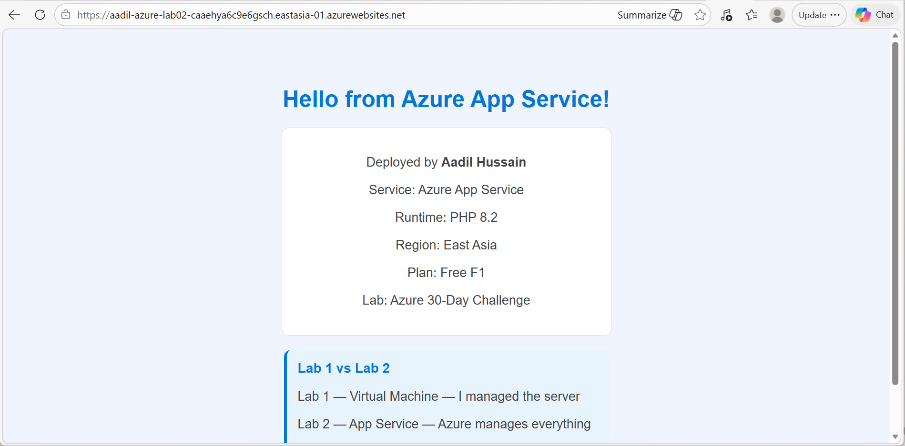
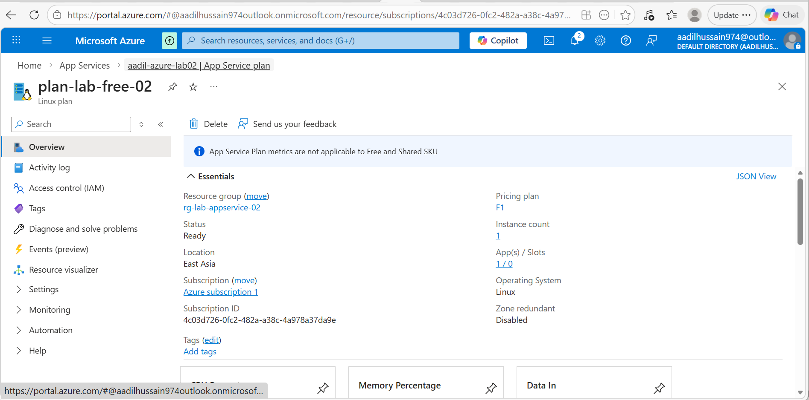
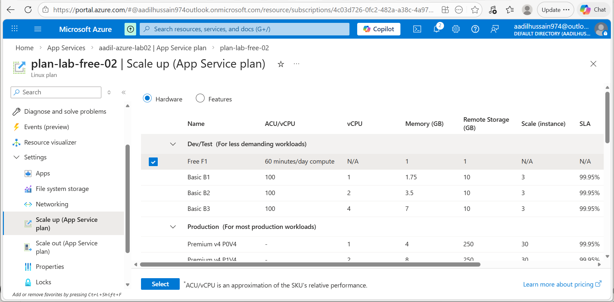

# Lab 02 — Azure App Service
**Name:** Aadil Hussain
**Date Started:** 31 March 2026
**Status:** 🔄 In Progress

---

## What I Am Building
A web application deployed on Azure App Service without
managing any servers or operating systems. The app will
be live at a free azurewebsites.net domain automatically
provided by Azure.

---

## Key Concepts

### IaaS vs PaaS
- Lab 1 was IaaS — I managed the VM, OS, and web server myself
- Lab 2 is PaaS — Azure manages everything, I just deploy code
- PaaS is faster, easier, and preferred for most web applications

### App Service Plan
- The compute resource that powers the web app
- Like choosing a VM size but for App Service
- Free F1 tier gives 60 minutes compute per day at zero cost
- Multiple web apps can share one App Service Plan

---

## Phase 1 — Resource Group and App Service Plan ✅

### What I Did
- Created resource group rg-lab-appservice-02 in East Asia
- Navigated to App Service Plans
- Created plan-lab-free-02 using Free F1 pricing tier
- Selected Linux as operating system

### Settings I Used
| Field | Value |
|  ---  |  ---  |
| Resource group | rg-lab-appservice-02 |
| Plan name | plan-lab-free-02 |
| Operating system | Linux |
| Region | East Asia |
| Pricing tier | Free F1 |

### What I Learned
- App Service Plan is the container for web apps
- Free F1 tier is completely free — no credit used
- Linux plans are cheaper than Windows plans
- One plan can host multiple web apps

### Screenshots



---

## Problems I Faced
| Problem | What I Tried | How I Fixed It |

| Free F1 not available in North Europe | Tried West Europe too | Changed region to East Asia and it worked |
---

## Phase 2 — Create Web App ✅ COMPLETED

### What I Did
- Navigated to App Services in Azure Portal
- Clicked Create then Web App
- Filled in all settings on the Basics tab
- Left all other tabs as default
- Clicked Review + create
- Clicked Create and waited 2 minutes for deployment
- Clicked Go to resource and explored the Web App overview
- Visited the default domain URL and saw 502 error
- 502 error is normal — means app is live but no code deployed yet

### Settings I Used
| Field | Value |
|---|---|
| Subscription | Azure subscription 1 |
| Resource group | rg-lab-appservice-02 |
| App name | aadil-azure-lab02 |
| Publish | Code |
| Runtime stack | PHP 8.2 |
| Operating System | Linux |
| Region | East Asia |
| App Service Plan | plan-lab-free-02 |
| Pricing tier | Free F1 |

### My Web App URL
https://aadil-azure-lab02-caaehya6c9e6gsch.eastasia-01.azurewebsites.net

### What the 502 Error Means
A 502 error at this stage is completely normal and expected.
It means the App Service is running and responding but has
no code inside it yet. Once we deploy our HTML code in
Phase 3 the 502 will disappear and our custom page will
show instead.

### Key Difference From Lab 1
| | Lab 1 VM | Lab 2 App Service |
|---|---|---|
| Access method | Public IP address | Domain name URL |
| Server setup | Manual SSH and Nginx | Automatic by Azure |
| OS management | Done by me | Done by Azure |
| Code deployment | nano editor via SSH | Azure deployment tools |
| Time to deploy | 30 minutes | 5 minutes |

### What I Learned
- Web App name must be globally unique across all Azure customers
- Azure automatically provides a free azurewebsites.net subdomain
- Runtime stack defines what programming language the app uses
- App Service Plan and Web App must be in the same region
- PaaS requires zero server management compared to IaaS
- A 502 error means the server is running but has no code yet
- No SSH no Nginx installation no Linux commands needed
- App Service is much faster to set up than a Virtual Machine

### Problems I Faced
| Problem | What I Tried | How I Fixed It |
|---|---|---|
| Missed validation and deployment screenshots | Could not go back | Noted in documentation and will not miss next time |
| 502 error on URL | Checked Azure Portal | Normal — no code deployed yet — fixed in Phase 3 |

### Screenshots
### Screenshots

— Note: Missed this screenshot during creation —




---

## Phase 3 — Deploy Code ✅ COMPLETED

### What I Did
- Created index.php file in VS Code with custom HTML content
- Tried deploying via VS Code Azure extension — got stuck for 33 minutes
- Cancelled stuck deployment and switched to Kudu method
- Started the Web App which was showing Stopped status
- Navigated to Advanced Tools → Kudu in Azure Portal
- Created deploy.zip using PowerShell Compress-Archive command
- Uploaded deploy.zip via Kudu Zip Push Deploy
- Visited the URL and saw custom page loading successfully
- 502 error completely gone and website is live

### File I Created
| File | Location | Purpose |
|---|---|---|
| index.php | Lab02-AppService folder | Custom HTML web page |
| deploy.zip | Lab02-AppService folder | ZIP package for Kudu deployment |

### Why index.php Not index.html
The runtime stack is PHP 8.2 so the default file
must be index.php. PHP can serve plain HTML perfectly.
Azure App Service looks for index.php as the default
page when PHP runtime is selected.

### Command I Used to Create ZIP
```powershell
Compress-Archive -Path "index.php" -DestinationPath "deploy.zip"
```

### Deployment Method — Kudu Zip Push Deploy
Kudu is Azure App Service's built in deployment tool.
It is accessible via Advanced Tools in the App Service sidebar.
Zip Push Deploy uploads a ZIP file directly to the wwwroot
folder of the App Service — fast and reliable.

### How to Access Kudu
Azure Portal → App Service → Development Tools →
Advanced Tools → Go → Tools → Zip Push Deploy

### My Live Website URL
https://aadil-azure-lab02-caaehya6c9e6gsch.eastasia-01.azurewebsites.net

### Problems I Faced
| Problem | What I Tried | How I Fixed It |
|---|---|---|
| VS Code deployment stuck hours | Waited and cancelled | Used Kudu instead |
| Web App status was Stopped | Checked App Services list | Clicked Start button |
| Kudu needed ZIP not individual files | Read upload instructions | Used Compress-Archive in PowerShell |
| Free F1 daily compute limit reached | Waited until next day | Compute resets every 24 hours |

### Comparison — VS Code vs Kudu Deployment
| Method | Time | Reliability | Best For |
|---|---|---|---|
| VS Code Extension | 2 to 5 min normally | Can get stuck | Regular updates |
| Kudu Zip Push | Under 1 minute | Very reliable | Quick deployments |
| Local Git push | 1 to 2 minutes | Reliable | CI/CD pipelines |

### What I Learned
- App Service Free F1 tier has 60 minute daily compute limit
- Kudu is Azure's built in deployment and management tool
- Zip Push Deploy is the fastest and most reliable method
- PowerShell Compress-Archive creates ZIP files from terminal
- Web App must be Running status before deployment works
- PHP runtime requires index.php as the default page name
- PaaS deployment is much simpler than IaaS SSH deployment
- Always check App Service status before troubleshooting deployment

### Screenshots



---

## Phase 4 — Configure Settings ✅ COMPLETED
### What I Did
- Navigated to Environment variables in App Service settings
- Added 3 environment variables to the app
- Saved settings and confirmed app restart
- Verified app was still running after restart
- Explored App Service Plan details and limits
- Viewed Scale up options showing available pricing tiers

### Environment Variables I Added
| Name | Value | Purpose |
|---|---|---|
| APP_ENVIRONMENT | production | Identifies the environment type |
| APP_OWNER | Aadil Hussain | Identifies the app owner |
| LAB_NAME | Azure 30-Day Challenge Lab 02 | Identifies the lab |

### Why Environment Variables Matter
In real applications you never put sensitive information
like passwords or API keys directly in your code because:
- Anyone who reads the code can see the password
- If you push code to GitHub the password becomes public
- Changing the password requires changing and redeploying code

Environment variables solve this by storing values outside
the code. The app reads them at runtime. Nobody sees the
values in the source code.

### Real World Example
Instead of writing this in code:
password = "MySecretPassword123"

You write:
password = os.getenv("DB_PASSWORD")

And store the actual password as an environment variable
in Azure App Service settings securely.

### App Service Plan Details
| Setting | Value |
|---|---|
| Plan name | plan-lab-free-02 |
| Pricing tier | Free F1 |
| Daily CPU limit | 60 minutes |
| Memory | 1 GB |
| Storage | 1 GB |
| Custom domains | Not supported on Free |
| SSL certificates | Not supported on Free |

### What I Learned
- Environment variables store config values outside the code
- Never hardcode passwords or API keys in application code
- App Service restarts automatically when settings are changed
- Free F1 tier has 60 minute daily CPU compute limit
- Scale up allows upgrading plan without recreating the app
- Scaling takes minutes and requires no code changes
- Environment variables are encrypted at rest in Azure

### Screenshots





---

## Phase 5 — Cleanup
🔄 Not started yet

---

## Problems I Faced


## What I Learned


---

## Cost Tracking

---