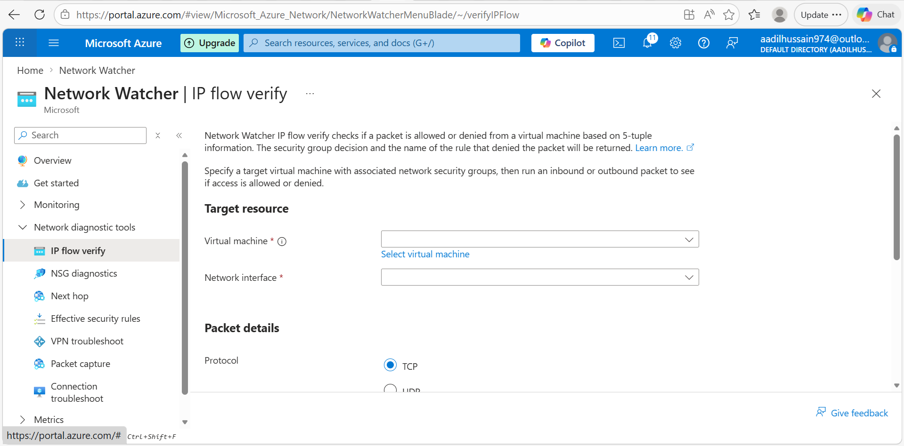
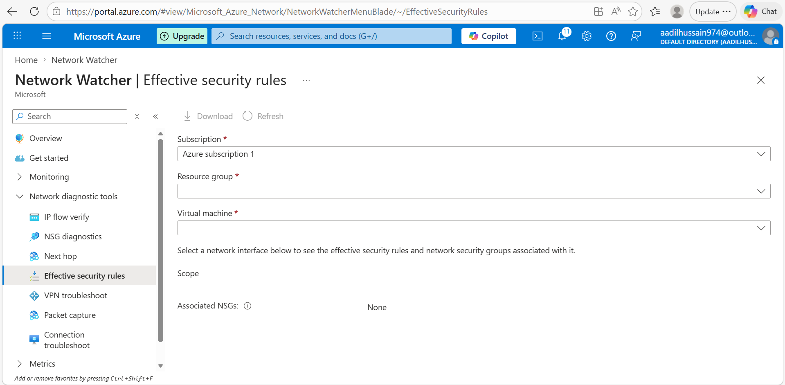
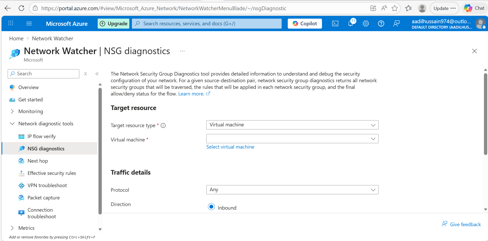
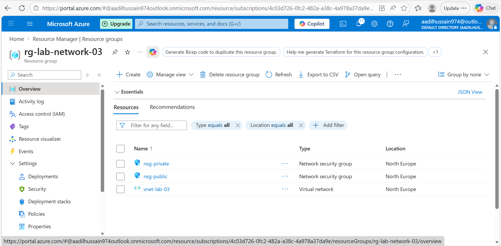
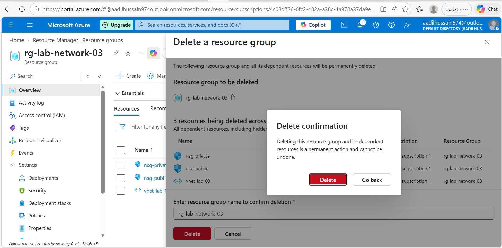
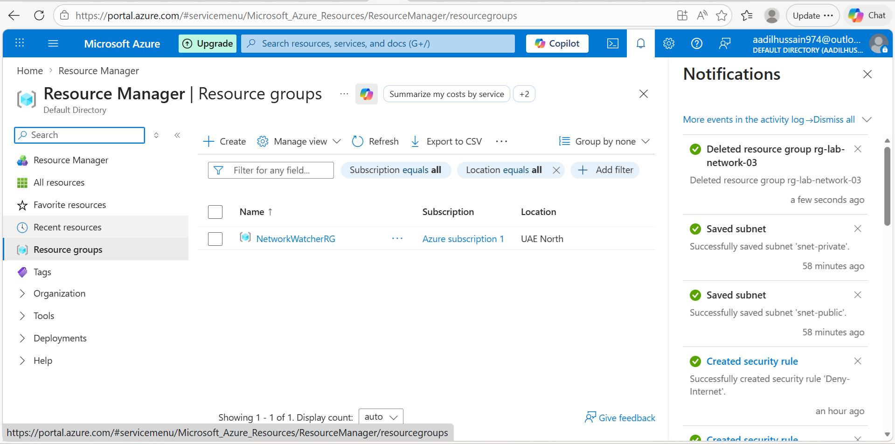
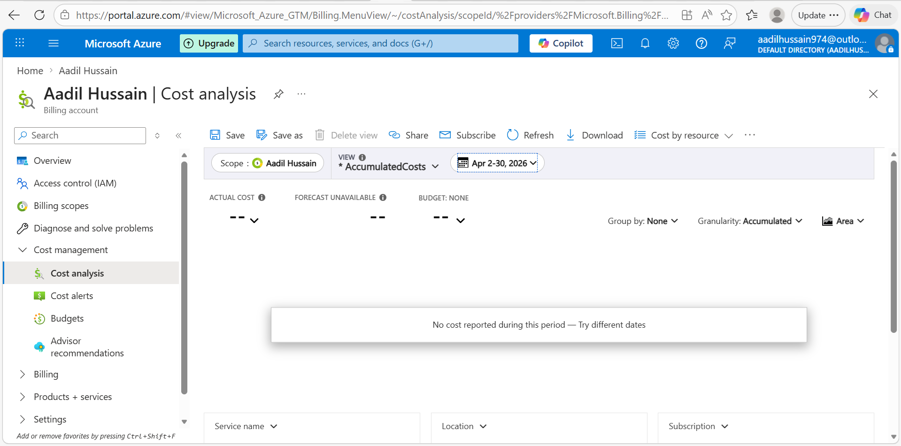

# Lab 03 — Azure Networking — VNet and NSGs
**Name:** Aadil Hussain
**Date Started:** 2 April 2026
**Date Completed:** 4 April 2026
**Total Time Taken:** [2days]
**Status:** ✅ COMPLETED

---

## What I Am Building
A Virtual Network with two subnets — one public and one
private — with Network Security Groups controlling traffic
between them. This simulates a real production network
architecture separating web servers from databases.

---

## Key Concepts

### Virtual Network
A VNet is a private isolated network in Azure.
It is like your own office LAN but in the cloud.
Resources inside a VNet can communicate with each
other privately without going through the internet.

### Subnets
Subnets divide a VNet into smaller segments.
Public subnet hosts internet facing resources.
Private subnet hosts backend resources like databases.
This separation improves security significantly.

### CIDR Notation
10.0.0.0/16 = Entire VNet — 65536 IP addresses
10.0.1.0/24 = Public subnet — 256 IP addresses
10.0.2.0/24 = Private subnet — 256 IP addresses
Azure reserves 5 IPs per subnet automatically.

### Network Security Group
NSG is Azure's virtual firewall.
It controls inbound and outbound traffic.
Rules have priority — lower number checked first.
Each rule allows or denies specific traffic.

---

## Phase 1 — Resource Group and VNet ✅ COMPLETED

### What I Did
- Searched for Resource Groups in Azure Portal
- Created rg-lab-network-03 in North Europe
- Navigated to Virtual Networks and clicked Create
- Named the VNet vnet-lab-03
- Left IP address space as 10.0.0.0/16
- Deleted the default subnet
- Added snet-public with range 10.0.1.0/24
- Added snet-private with range 10.0.2.0/24
- Reviewed settings and clicked Create
- Waited 1 minute for deployment
- Verified both subnets visible in VNet Subnets page

### Settings I Used
| Field | Value |
|---|---|
| Resource group | rg-lab-network-03 |
| VNet name | vnet-lab-03 |
| Region | North Europe |
| Address space | 10.0.0.0/16 |
| Public subnet name | snet-public |
| Public subnet range | 10.0.1.0/24 |
| Private subnet name | snet-private |
| Private subnet range | 10.0.2.0/24 |

### Why These IP Ranges
10.0.0.0/16 gives the VNet 65536 IP addresses total.
Splitting into /24 subnets gives 256 IPs each.
Azure reserves 5 IPs per subnet leaving 251 usable.
Using 10.0.1.x for public and 10.0.2.x for private
makes the architecture easy to read and understand.

### What I Learned
- VNet is Azure's private isolated network
- Address space defines the total IP pool for the VNet
- Subnets segment the VNet into logical zones
- Public subnet is for resources facing the internet
- Private subnet is for backend resources like databases
- CIDR /16 gives 65536 addresses
- CIDR /24 gives 256 addresses per subnet
- Azure always reserves 5 IP addresses per subnet
- VNet creation is completely free in Azure

### Screenshots

---

## Phase 2 — Network Security Groups ✅ COMPLETED

### What I Did
- Navigated to Network Security Groups in Azure Portal
- Created nsg-public in rg-lab-network-03 North Europe
- Added 3 inbound rules to nsg-public
- Created nsg-private in rg-lab-network-03 North Europe
- Added Allow-From-Public-Subnet rule to nsg-private
- Added Deny-Internet rule to nsg-private

### nsg-public Rules
| Priority | Name | Port | Action | Reason |
|---|---|---|---|---|
| 100 | Allow-HTTP | 80 | Allow | Web traffic from internet |
| 110 | Allow-HTTPS | 443 | Allow | Secure web traffic |
| 120 | Allow-SSH | 22 | Allow | Remote management |

### nsg-private Rules
| Priority | Name | Source | Action | Reason |
|---|---|---|---|---|
| 100 | Allow-From-Public-Subnet | 10.0.1.0/24 | Allow | Web server can reach database |
| 200 | Deny-Internet | Internet | Deny | Block all internet access |

### How NSG Priority Works
Rules are evaluated from lowest priority number first.
Priority 100 is checked before priority 200.
The first matching rule wins — no further rules checked.
This is why we put Allow rules at lower numbers than Deny.

### Why Two Separate NSGs
nsg-public protects the web server subnet.
It allows web traffic from anyone on the internet.
nsg-private protects the database subnet.
It only allows traffic from the web server subnet.
This creates a layered security model called defence in depth.

### Real World Application
In production this architecture means:
- Users access the website through the public subnet
- Web server talks to database through the private subnet
- Database is completely hidden from the internet
- Even if web server is hacked database stays protected

### What I Learned
- NSGs are Azure's virtual firewall for subnets
- Rules have priorities — lower number checked first
- First matching rule wins — processing stops there
- Source can be Any, IP address, or Service Tag
- Service Tags like Internet represent groups of IPs
- Two NSGs provide layered security — defence in depth
- Private subnet should never allow direct internet access
- NSG creation is completely free in Azure

### Screenshots

---

## Phase 3 — Associate NSGs to Subnets ✅ COMPLETED

### What I Did
- Navigated to vnet-lab-03 in Azure Portal
- Opened Subnets page showing both subnets
- Clicked snet-public and associated nsg-public
- Saved the association and waited for it to apply
- Clicked snet-private and associated nsg-private
- Saved the association and waited for it to apply
- Verified both subnets showing correct NSG names
- Verified from NSG side that subnets are listed
- Viewed network topology diagram in Network Watcher

### NSG Associations
| Subnet | NSG | Purpose |
|---|---|---|
| snet-public 10.0.1.0/24 | nsg-public | Protects web server tier |
| snet-private 10.0.2.0/24 | nsg-private | Protects database tier |

### Why Association Matters
Creating an NSG alone does nothing.
The NSG must be associated to a subnet to take effect.
Once associated every resource in that subnet
automatically inherits the NSG rules.
This is like installing a security door in a building —
the door must be hung in the doorframe to work.

### What the Architecture Looks Like Now
Internet
↓
nsg-public (Allow HTTP 80, HTTPS 443, SSH 22)
↓
snet-public (10.0.1.0/24) — Web server zone
↓
nsg-private (Allow from 10.0.1.0/24 only, Deny Internet)
↓
snet-private (10.0.2.0/24) — Database zone

### What I Learned
- NSGs must be associated to subnets to take effect
- Association is done through the subnet settings
- One NSG can protect multiple subnets
- One subnet can only have one NSG at a time
- Resources inherit NSG rules from their subnet automatically
- Network Watcher topology shows visual network diagram
- NSG association takes effect within seconds

### Screenshots

---

## Phase 4 — Verify and Test ✅ COMPLETED

### What I Did
- Navigated to nsg-public and confirmed 3 inbound rules
- Confirmed nsg-public is associated with 1 subnet
- Navigated to Network Watcher in Azure Portal
- Explored all Network diagnostic tools available
- Found IP Flow Verify tool — requires VM to test fully
- Found Effective Security Rules tool
- Found NSG Diagnostics tool
- Took screenshots of all Network Watcher tools
- Confirmed entire network architecture is correctly set up

### Resources Confirmed in rg-lab-network-03
| Resource | Type | Status |
|---|---|---|
| vnet-lab-03 | Virtual Network | Active |
| nsg-public | Network Security Group | Active — 3 inbound rules |
| nsg-private | Network Security Group | Active — 2 inbound rules |
| snet-public | Subnet | Associated with nsg-public |
| snet-private | Subnet | Associated with nsg-private |

### nsg-public Confirmed Rules
| Priority | Name | Port | Protocol | Action |
|---|---|---|---|---|
| 100 | Allow-HTTP | 80 | TCP | Allow |
| 110 | Allow-HTTPS | 443 | TCP | Allow |
| 120 | Allow-SSH | 22 | TCP | Allow |

### nsg-private Confirmed Rules
| Priority | Name | Source | Action |
|---|---|---|---|
| 100 | Allow-From-Public-Subnet | 10.0.1.0/24 | Allow |
| 200 | Deny-Internet | Internet | Deny |

### Network Watcher Tools I Explored
| Tool | What It Does | Requires VM |
|---|---|---|
| IP Flow Verify | Tests if traffic allowed or denied by NSG | Yes |
| NSG Diagnostics | Analyses NSG rules and finds issues | Yes |
| Next Hop | Shows where traffic goes from a VM | Yes |
| Effective Security Rules | Shows all active rules on a resource | Yes |
| VPN Troubleshoot | Diagnoses VPN gateway issues | Yes |
| Packet Capture | Captures network packets for analysis | Yes |
| Connection Troubleshoot | Tests connectivity between endpoints | Yes |

### Why IP Flow Verify is Useful
IP Flow Verify lets you test NSG rules without
actually sending any real network traffic.
You specify a source IP, destination IP, port
and direction — inbound or outbound.
It tells you which NSG rule would allow or deny
that specific traffic and which rule matched.
This is extremely useful for debugging connectivity
issues in production environments without risk.

### Complete Architecture Verified
Internet
↓
nsg-public
Allow HTTP port 80
Allow HTTPS port 443
Allow SSH port 22
↓
snet-public (10.0.1.0/24)
Web server zone
↓
nsg-private
Allow only from 10.0.1.0/24
Deny all internet traffic
↓
snet-private (10.0.2.0/24)
Database zone — fully protected

### What I Learned
- Network Watcher is Azure's built in network monitoring service
- It is created automatically when you deploy VMs or VNets
- IP Flow Verify tests traffic rules without real packets
- Effective Security Rules shows combined active rules
- NSG Diagnostics helps find misconfigured rules quickly
- All diagnostic tools require a VM with network interface
- Network Watcher tools are completely free to use
- Always verify network architecture before deploying resources
- nsg-public correctly shows Associated with 1 subnet

### Screenshots

---

## Phase 5 — Cleanup ✅ COMPLETED

### What I Did
- Took final screenshot of subnets with NSGs attached
- Navigated to Resource Groups in Azure Portal
- Confirmed all 3 resources in rg-lab-network-03
- Clicked Delete resource group
- Typed rg-lab-network-03 to confirm deletion
- Ticked confirmation checkbox
- Clicked red Delete button
- Waited 3 minutes for deletion to complete
- Confirmed rg-lab-network-03 is gone from list
- Checked Cost Management — VNet and NSGs are free

### Resources Deleted
| Resource | Type |
|---|---|
| vnet-lab-03 | Virtual Network |
| nsg-public | Network Security Group |
| nsg-private | Network Security Group |

### Cost This Lab Used
| Resource | Cost |
|---|---|
| Virtual Network | $0.00 — always free |
| Subnets | $0.00 — always free |
| NSGs | $0.00 — always free |
| Total | $0.00 |

### What I Learned
- VNet and NSGs are completely free in Azure
- Deleting resource group removes everything at once
- NetworkWatcherRG stays behind — always leave it
- Free networking resources allow unlimited practice
- Always clean up even free resources — good habit

### Screenshots

---

## Problems I Faced
| Problem | What I Tried | How I Fixed It |
|---|---|---|
| Could not find Effective Security Rules in NSG sidebar | Searched through all sidebar options | Found it inside Network Watcher under Network diagnostic tools |
| IP Flow Verify requires a VM to work | Tried to run it without a VM | Took screenshot of the tool page and documented what it does instead |
| Effective Security Rules also requires VM network interface | Tried to use it without a VM | Documented the tool and took screenshots to show awareness |
| NSG diagnostic tools all require a VM | Explored all tools | Understood that these tools are for troubleshooting live resources |

---

## What I Learned
- Virtual Networks provide private isolated networking in Azure
- Subnets segment a VNet into logical security zones
- CIDR notation defines IP address ranges efficiently
- NSGs act as virtual firewalls controlling traffic flow
- NSG rules use priority numbers — lower checked first
- First matching rule wins — processing stops there
- Public subnet allows internet traffic for web servers
- Private subnet blocks internet for database protection
- NSGs must be associated to subnets to take effect
- Network Watcher provides powerful diagnostic tools
- IP Flow Verify tests traffic rules without real packets
- VNet and NSGs are completely free in Azure
- This architecture is used in real production environments
---

## Cost Tracking
| Resource | Cost |
|---|---|
| Virtual Network | Free |
| Subnets | Free |
| NSGs | Free |
| Total | $0.00 |

---

## My Confidence Rating After This Lab
| Skill | Before | After |
|---|---|---|
| Understanding VNets | 1 | 3 |
| Configuring subnets | 1 | 3 |
| Creating NSG rules | 1 | 4 |
| Understanding CIDR | 1 | 3 |
| Network security concepts | 1 | 3 |
| Using Network Watcher | 1 | 2 |

---

## What I Would Do Differently Next Time
1. Deploy a VM in each subnet to fully test NSG rules
2. Use IP Flow Verify to confirm traffic is allowed
   or denied as expected before going to production
3. Test the Deny-Internet rule is actually blocking
   by trying to connect to the internet from the VM
4. Add outbound NSG rules as well for complete control
5. Document the architecture diagram from the start