# Lab 03 — Azure Networking — VNet and NSGs
**Name:** Aadil Hussain
**Date Started:** 2 April 2026
**Status:** 🔄 In Progress

---

## What I Am Building
A Virtual Network with two subnets — one public and one
private — with Network Security Groups controlling traffic
between them. This simulates a real production network
architecture separating web servers from databases.

---

## Key Concepts

### Virtual Network
A VNet is a private isolated network in Azure.
It is like your own office LAN but in the cloud.
Resources inside a VNet can communicate with each
other privately without going through the internet.

### Subnets
Subnets divide a VNet into smaller segments.
Public subnet hosts internet facing resources.
Private subnet hosts backend resources like databases.
This separation improves security significantly.

### CIDR Notation
10.0.0.0/16 = Entire VNet — 65536 IP addresses
10.0.1.0/24 = Public subnet — 256 IP addresses
10.0.2.0/24 = Private subnet — 256 IP addresses
Azure reserves 5 IPs per subnet automatically.

### Network Security Group
NSG is Azure's virtual firewall.
It controls inbound and outbound traffic.
Rules have priority — lower number checked first.
Each rule allows or denies specific traffic.

---

## Phase 1 — Resource Group and VNet ✅ COMPLETED

### What I Did
- Searched for Resource Groups in Azure Portal
- Created rg-lab-network-03 in North Europe
- Navigated to Virtual Networks and clicked Create
- Named the VNet vnet-lab-03
- Left IP address space as 10.0.0.0/16
- Deleted the default subnet
- Added snet-public with range 10.0.1.0/24
- Added snet-private with range 10.0.2.0/24
- Reviewed settings and clicked Create
- Waited 1 minute for deployment
- Verified both subnets visible in VNet Subnets page

### Settings I Used
| Field | Value |
|---|---|
| Resource group | rg-lab-network-03 |
| VNet name | vnet-lab-03 |
| Region | North Europe |
| Address space | 10.0.0.0/16 |
| Public subnet name | snet-public |
| Public subnet range | 10.0.1.0/24 |
| Private subnet name | snet-private |
| Private subnet range | 10.0.2.0/24 |

### Why These IP Ranges
10.0.0.0/16 gives the VNet 65536 IP addresses total.
Splitting into /24 subnets gives 256 IPs each.
Azure reserves 5 IPs per subnet leaving 251 usable.
Using 10.0.1.x for public and 10.0.2.x for private
makes the architecture easy to read and understand.

### What I Learned
- VNet is Azure's private isolated network
- Address space defines the total IP pool for the VNet
- Subnets segment the VNet into logical zones
- Public subnet is for resources facing the internet
- Private subnet is for backend resources like databases
- CIDR /16 gives 65536 addresses
- CIDR /24 gives 256 addresses per subnet
- Azure always reserves 5 IP addresses per subnet
- VNet creation is completely free in Azure

### Screenshots
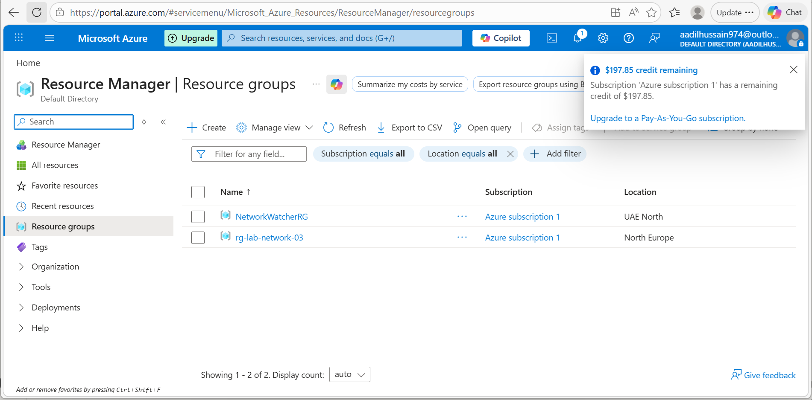
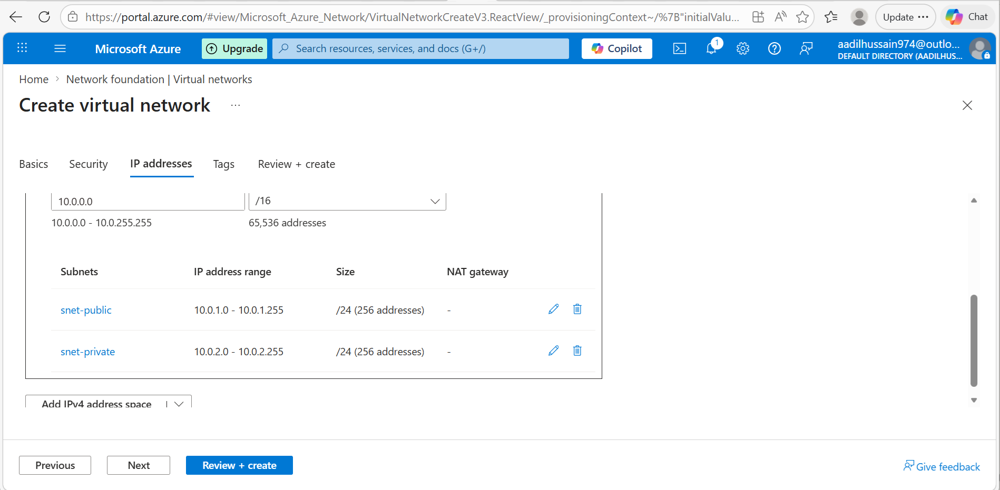
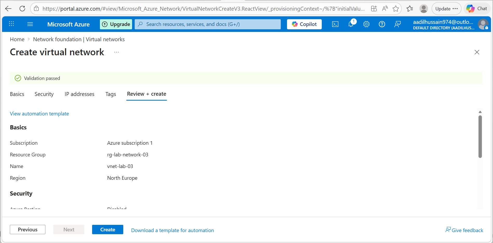
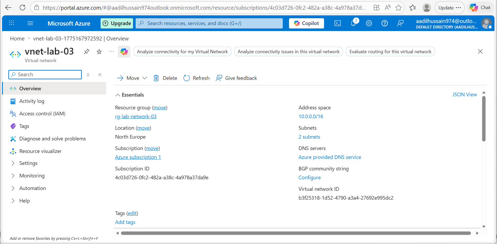

---

## Phase 2 — Network Security Groups ✅ COMPLETED

### What I Did
- Navigated to Network Security Groups in Azure Portal
- Created nsg-public in rg-lab-network-03 North Europe
- Added 3 inbound rules to nsg-public
- Created nsg-private in rg-lab-network-03 North Europe
- Added Allow-From-Public-Subnet rule to nsg-private
- Added Deny-Internet rule to nsg-private

### nsg-public Rules
| Priority | Name | Port | Action | Reason |
|---|---|---|---|---|
| 100 | Allow-HTTP | 80 | Allow | Web traffic from internet |
| 110 | Allow-HTTPS | 443 | Allow | Secure web traffic |
| 120 | Allow-SSH | 22 | Allow | Remote management |

### nsg-private Rules
| Priority | Name | Source | Action | Reason |
|---|---|---|---|---|
| 100 | Allow-From-Public-Subnet | 10.0.1.0/24 | Allow | Web server can reach database |
| 200 | Deny-Internet | Internet | Deny | Block all internet access |

### How NSG Priority Works
Rules are evaluated from lowest priority number first.
Priority 100 is checked before priority 200.
The first matching rule wins — no further rules checked.
This is why we put Allow rules at lower numbers than Deny.

### Why Two Separate NSGs
nsg-public protects the web server subnet.
It allows web traffic from anyone on the internet.
nsg-private protects the database subnet.
It only allows traffic from the web server subnet.
This creates a layered security model called defence in depth.

### Real World Application
In production this architecture means:
- Users access the website through the public subnet
- Web server talks to database through the private subnet
- Database is completely hidden from the internet
- Even if web server is hacked database stays protected

### What I Learned
- NSGs are Azure's virtual firewall for subnets
- Rules have priorities — lower number checked first
- First matching rule wins — processing stops there
- Source can be Any, IP address, or Service Tag
- Service Tags like Internet represent groups of IPs
- Two NSGs provide layered security — defence in depth
- Private subnet should never allow direct internet access
- NSG creation is completely free in Azure

### Screenshots
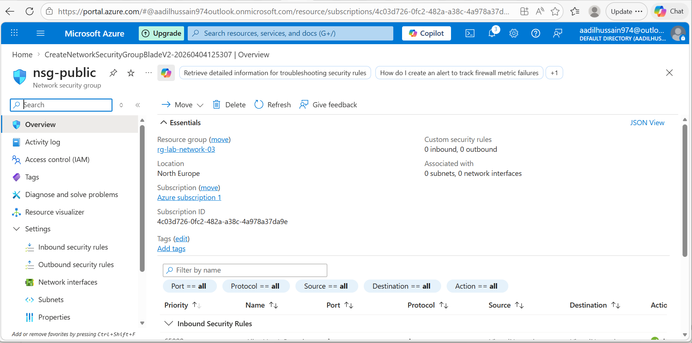
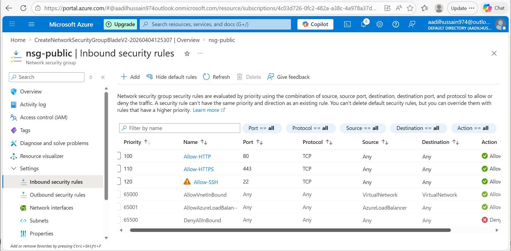
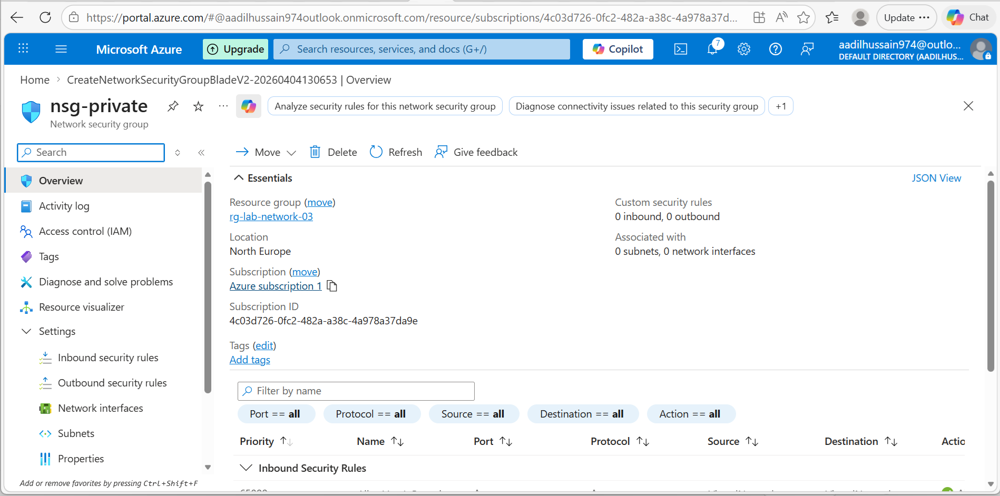
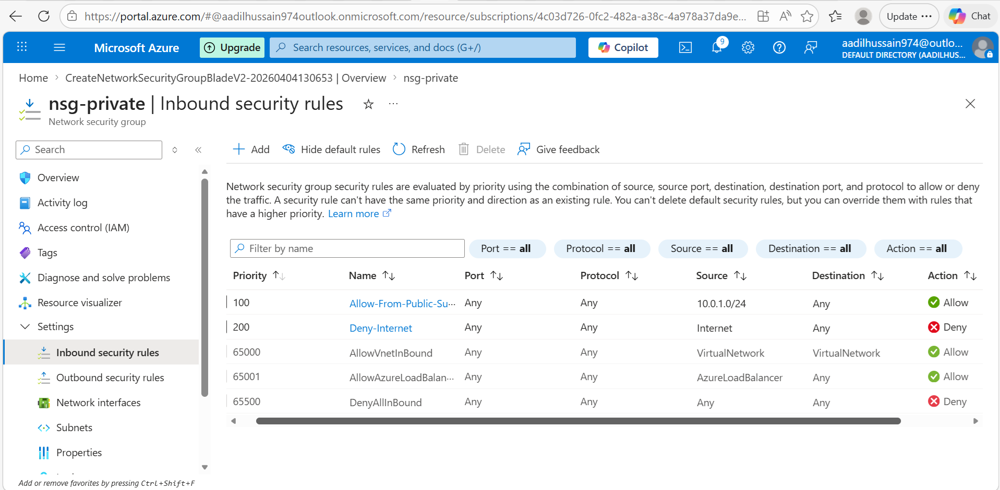

---

## Phase 3 — Associate NSGs to Subnets ✅ COMPLETED

### What I Did
- Navigated to vnet-lab-03 in Azure Portal
- Opened Subnets page showing both subnets
- Clicked snet-public and associated nsg-public
- Saved the association and waited for it to apply
- Clicked snet-private and associated nsg-private
- Saved the association and waited for it to apply
- Verified both subnets showing correct NSG names
- Verified from NSG side that subnets are listed
- Viewed network topology diagram in Network Watcher

### NSG Associations
| Subnet | NSG | Purpose |
|---|---|---|
| snet-public 10.0.1.0/24 | nsg-public | Protects web server tier |
| snet-private 10.0.2.0/24 | nsg-private | Protects database tier |

### Why Association Matters
Creating an NSG alone does nothing.
The NSG must be associated to a subnet to take effect.
Once associated every resource in that subnet
automatically inherits the NSG rules.
This is like installing a security door in a building —
the door must be hung in the doorframe to work.

### What the Architecture Looks Like Now
Internet
↓
nsg-public (Allow HTTP 80, HTTPS 443, SSH 22)
↓
snet-public (10.0.1.0/24) — Web server zone
↓
nsg-private (Allow from 10.0.1.0/24 only, Deny Internet)
↓
snet-private (10.0.2.0/24) — Database zone

### What I Learned
- NSGs must be associated to subnets to take effect
- Association is done through the subnet settings
- One NSG can protect multiple subnets
- One subnet can only have one NSG at a time
- Resources inherit NSG rules from their subnet automatically
- Network Watcher topology shows visual network diagram
- NSG association takes effect within seconds

### Screenshots
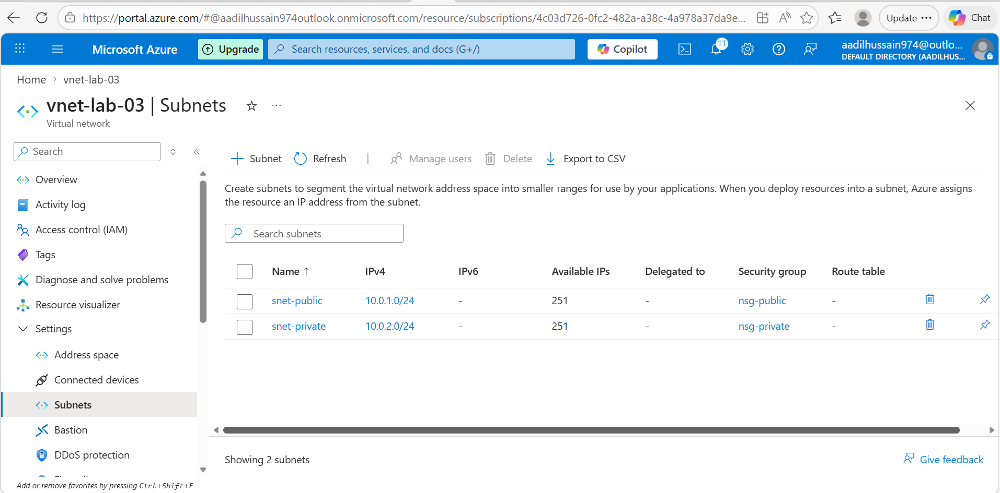
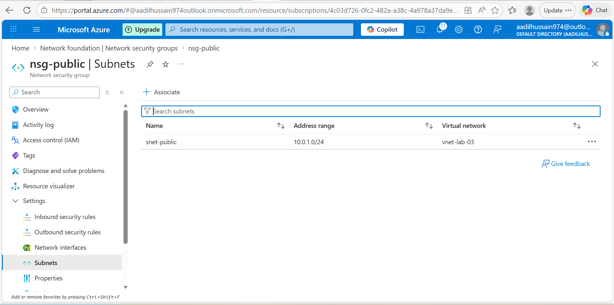
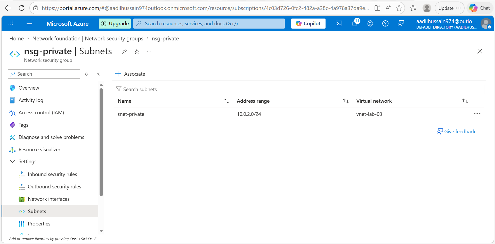
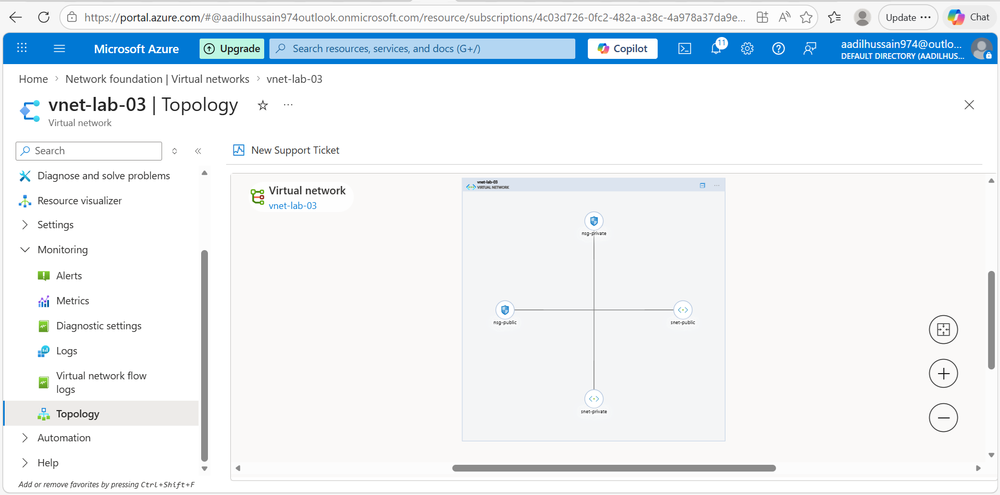
---

## Phase 4 — Verify and Test
🔄 Not started yet

---

## Phase 5 — Cleanup
🔄 Not started yet

---

## Problems I Faced
| Problem | What I Tried | How I Fixed It |
|---|---|---|
| Write here | Write here | Write here |

---

## What I Learned
Fill at the end of the lab

---

## Cost Tracking
| Resource | Cost |
|---|---|
| Virtual Network | Free |
| Subnets | Free |
| NSGs | Free |
| Total | $0.00 |

---

## My Confidence Rating After This Lab
| Skill | Before | After |
|---|---|---|
| Understanding VNets | 1 | fill in |
| Configuring subnets | 1 | fill in |
| Creating NSG rules | 1 | fill in |
| Understanding CIDR | 1 | fill in |
| Network security concepts | 1 | fill in |

---

## What I Would Do Differently Next Time
Fill at the end of the lab