# Lab 04 — Azure Load Balancer
**Name:** Aadil Hussain
**Date Started:** 3 April 2026
**Status:** 🔄 In Progress

---

## What I Am Building
Two Virtual Machines running Nginx web server behind
an Azure Load Balancer. Traffic from the internet gets
distributed evenly between both VMs automatically.
This demonstrates high availability — if one VM fails
the other continues serving traffic with no downtime.

---

## Key Concepts

### What is a Load Balancer
A Load Balancer distributes incoming traffic across
multiple servers. It works at Layer 4 of the OSI model
meaning it routes traffic based on IP and port only
without reading the content of the traffic.

### Why Load Balancing Matters
Single server = single point of failure
If that server goes down — website is down
Load Balancer + 2 servers = high availability
If one server goes down — other continues working

### Key Components
Frontend IP — The public IP users connect to
Backend Pool — The VMs that receive traffic
Health Probe — Checks if each VM is healthy
Load Balancing Rule — Defines how traffic is routed

### How Health Probes Work
The Load Balancer sends a request to each VM every 5 seconds
If a VM does not respond — it is marked unhealthy
Traffic stops going to unhealthy VMs automatically
When VM recovers — traffic resumes automatically

---

## Phase 1 — Resource Group and Network Setup ✅ COMPLETED

### What I Did
- Created resource group rg-lab-loadbalancer-04 in East Asia
- Created Virtual Network vnet-lab-04 with address space 10.0.0.0/16
- Added subnet snet-backend with range 10.0.1.0/24
- This subnet will host both backend VMs

### Settings I Used
| Field | Value |
|---|---|
| Resource group | rg-lab-loadbalancer-04 |
| VNet name | vnet-lab-04 |
| Region | East Asia |
| Address space | 10.0.0.0/16 |
| Subnet name | snet-backend |
| Subnet range | 10.0.1.0/24 |

### Why One Subnet This Time
In Lab 03 we had public and private subnets.
In Lab 04 both VMs are in the same subnet because
they both serve the same purpose — web servers.
The Load Balancer sits in front of them handling
the public traffic separation.

### What I Learned
- Load Balancer architecture needs VMs in same subnet
- Backend pool VMs share the same network segment
- VNet setup is the foundation for every Azure lab
- Same CIDR concepts from Lab 03 apply here

### Screenshots
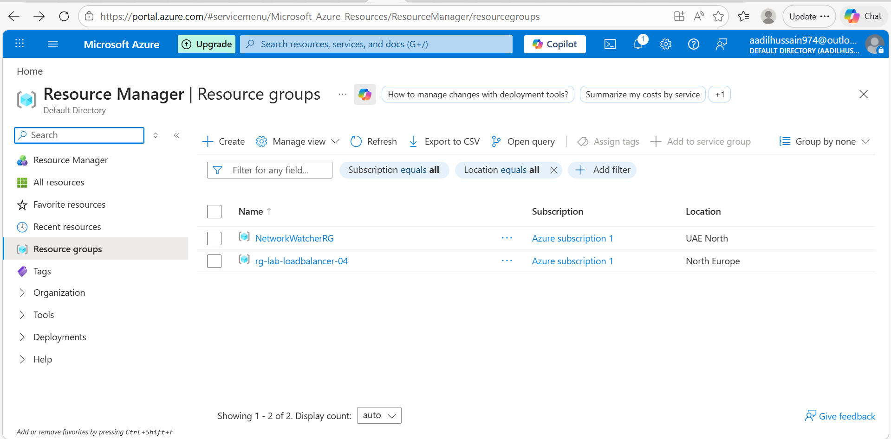
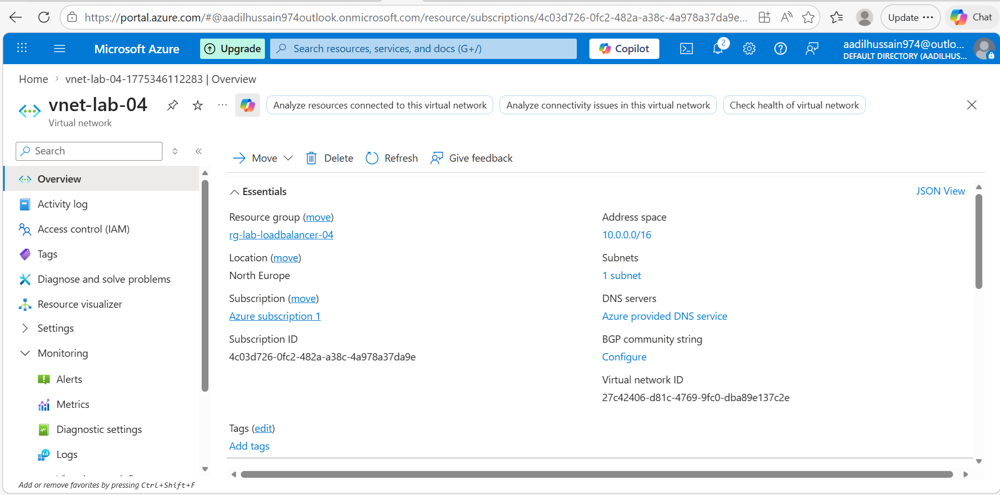

---

## Phase 2 — Create Two Virtual Machines ✅ COMPLETED

### What I Did
- Created vm-backend-01 in East Asia
- Selected Availability Set and created avset-lab-04
- Set Public IP to None — VMs stay private
- Tried Custom Script Extension for Nginx — provisioning failed
- Used Run Command method instead — worked successfully
- Created vm-backend-02 in same availability set avset-lab-04
- Used Run Command to install Nginx on VM-02
- Each VM shows different message to identify which one responds
- Verified both VMs showing Running status

### VM Settings Used
| Field | VM-01 | VM-02 |
|---|---|---|
| Name | vm-backend-01 | vm-backend-02 |
| Region | East Asia | East Asia |
| Image | Ubuntu 24.04 LTS | Ubuntu 24.04 LTS |
| Size | Standard_B2ats_v2 | Standard_B2ats_v2 |
| Availability set | avset-lab-04 | avset-lab-04 |
| Public IP | None | None |
| Subnet | snet-backend | snet-backend |

### Why No Public IP on VMs
In a load balanced architecture the public IP belongs
to the Load Balancer not the individual VMs.
Users connect to the Load Balancer public IP.
The Load Balancer forwards traffic to VMs privately.
This hides the VMs from direct internet access
which improves security significantly.

### Why Availability Set
An Availability Set ensures VMs run on different
physical hardware in the data centre.
Fault domains separate VMs across different server racks.
Update domains ensure not all VMs restart at once
during Azure maintenance operations.
This guarantees at least one VM is always running.

### Nginx Installation Method — Run Command
Custom Script Extension failed with provisioning error.
Used Run Command instead which is more reliable.
Run Command is found under Operations in VM left sidebar.
Select RunShellScript and paste the bash commands directly.

### Commands Used to Install Nginx
```bash
sudo apt-get update -y
sudo apt-get install -y nginx
sudo systemctl start nginx
sudo systemctl enable nginx
echo '<h1>Hello from VM-01</h1><p>Azure Load Balancer Lab - Deployed by Aadil Hussain</p>' | sudo tee /var/www/html/index.html
```

### VM-01 Custom Page Content
Hello from VM-01
Azure Load Balancer Lab - Deployed by Aadil Hussain

### VM-02 Custom Page Content
Hello from VM-02
Azure Load Balancer Lab - Deployed by Aadil Hussain

### Problems I Faced
| Problem | What I Tried | How I Fixed It |
|---|---|---|
| Custom Script Extension failed with provisioning error | Uninstalled and reinstalled extension | Used Run Command method instead which worked immediately |
| VM created in wrong region North Europe | Deleted and recreated | Moved everything to East Asia where B2ats_v2 is available |

### What I Learned
- Availability Sets provide physical hardware redundancy
- Fault domains separate VMs across different server racks
- Update domains prevent all VMs restarting simultaneously
- No public IP on backend VMs improves security
- Custom Script Extension can fail — Run Command is more reliable
- Run Command runs bash scripts directly on VM from portal
- Both VMs must be in same VNet and subnet for load balancing
- Different page content on each VM helps verify load balancing
- Nginx runs on port 80 by default after installation

### Screenshots
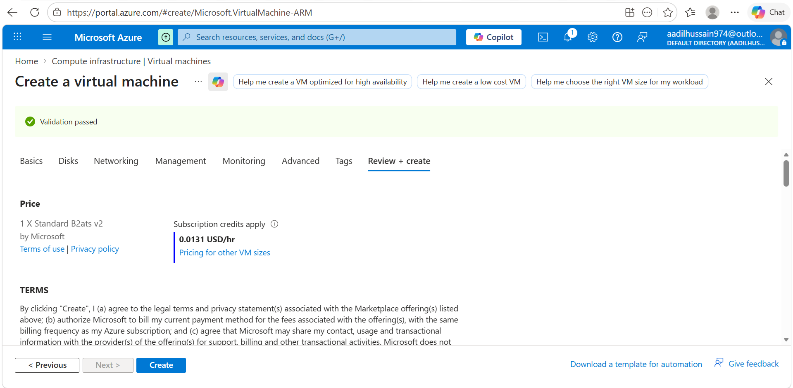
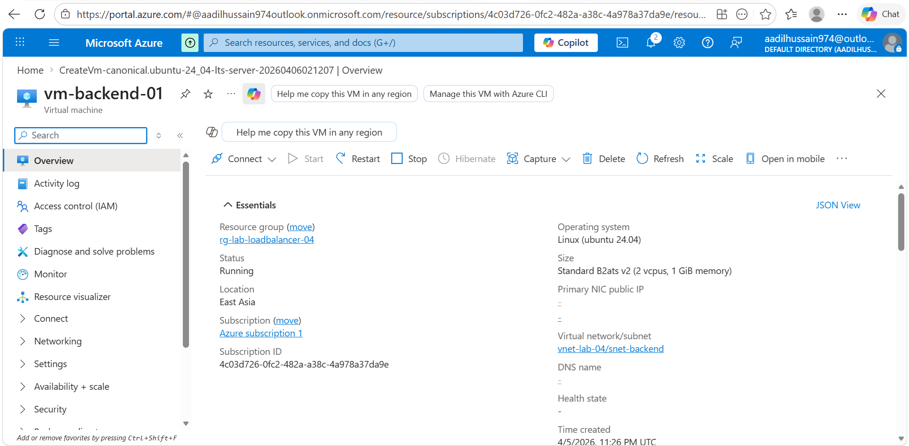
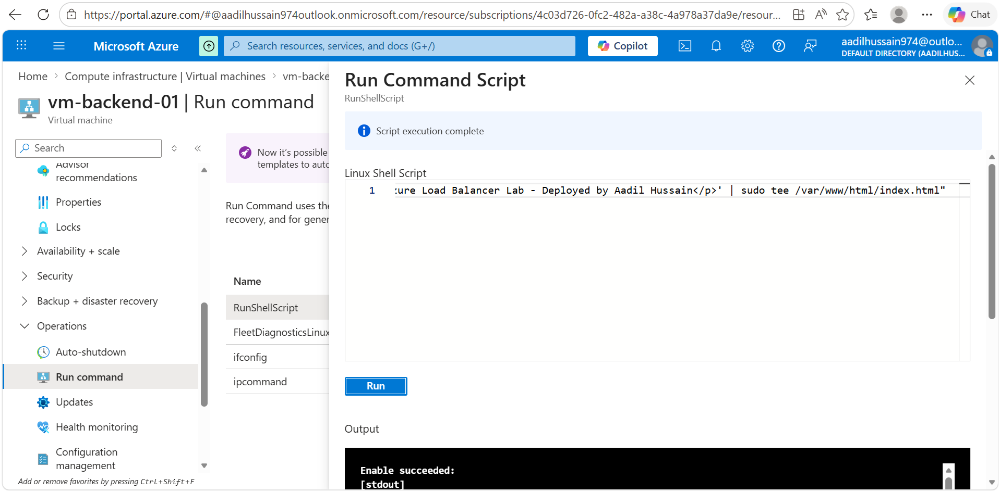
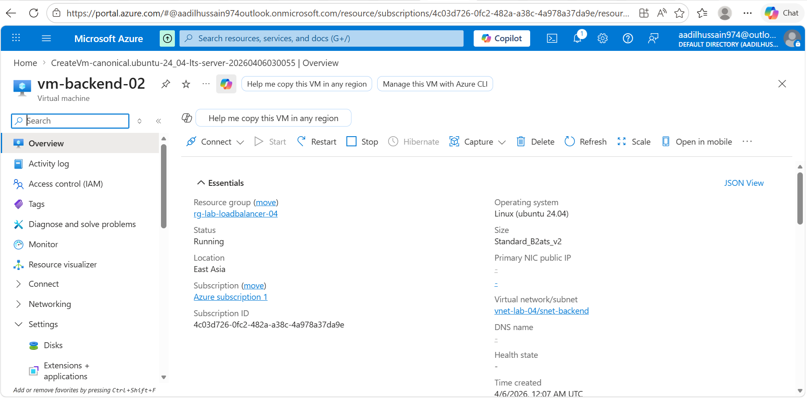
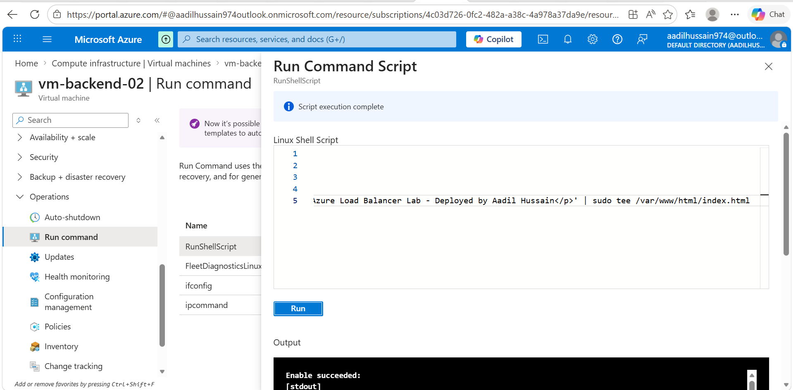
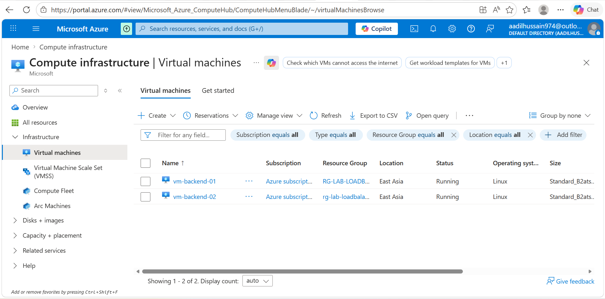

---

## Phase 3 — Create the Load Balancer ✅ COMPLETED

### What I Did
- Navigated to Load Balancers in Azure Portal
- Created lb-lab-04 with Standard SKU in East Asia
- Added frontend IP configuration lb-frontend-ip
- Created new public IP lb-public-ip
- Created backend pool lb-backend-pool with both VMs
- Added health probe inside the load balancing rule panel
- Added load balancing rule lb-rule-http for port 80
- Reviewed and created the Load Balancer successfully
- Noted the public IP address for testing in Phase 4

### Load Balancer Settings
| Field | Value |
|---|---|
| Name | lb-lab-04 |
| Region | East Asia |
| SKU | Standard |
| Type | Public |
| Frontend IP | lb-frontend-ip |
| Public IP | lb-public-ip |
| Backend pool | lb-backend-pool |
| VMs in pool | vm-backend-01 and vm-backend-02 |

### Health Probe Settings
| Field | Value |
|---|---|
| Name | lb-health-probe |
| Protocol | HTTP |
| Port | 80 |
| Path | / |
| Interval | 5 seconds |

### Load Balancing Rule Settings
| Field | Value |
|---|---|
| Name | lb-rule-http |
| Frontend IP | lb-frontend-ip |
| Backend pool | lb-backend-pool |
| Protocol | TCP |
| Frontend port | 80 |
| Backend port | 80 |
| Health probe | lb-health-probe |
| Session persistence | None |

### Load Balancer Components Explained
| Component | Purpose |
|---|---|
| Frontend IP | The public IP address users connect to |
| Backend pool | The group of VMs that receive traffic |
| Health probe | Checks if each VM is healthy every 5 seconds |
| LB Rule | Defines how traffic flows from frontend to backend |
| Session persistence None | Round robin — each request goes to next VM |

### How Health Probe Works
Every 5 seconds Load Balancer sends HTTP request to port 80
If VM responds — it is healthy — traffic continues
If VM does not respond — marked unhealthy
Traffic automatically stops going to unhealthy VM
When VM recovers — traffic automatically resumes
This is automatic failover with zero manual intervention

### Important Note About Portal Version
In the newer Azure Portal the health probe is created
inside the load balancing rule panel rather than as
a separate step. The unhealthy threshold field was
not visible — Azure applies a sensible default value.
This is normal behaviour in the updated portal UI.

### My Load Balancer Public IP
[13.75.50.75 (lb-public-ip)]

### What I Learned
- Load Balancer Standard SKU supports Availability Sets
- Frontend IP is what users connect to publicly
- Backend pool groups VMs that share the traffic load
- Health probes ensure traffic only goes to healthy VMs
- Session persistence None means round robin distribution
- Round robin sends each request to next VM in rotation
- Health probe is now created inside the LB rule in new portal
- Standard SKU Load Balancer requires Standard public IP
- Load Balancer creation takes about 2 minutes to complete

### Problems I Faced
| Problem | What I Tried | How I Fixed It |
|---|---|---|
| Health probe not showing as separate section | Scrolled through entire page | Found it inside the load balancing rule panel |
| Unhealthy threshold field not visible | Looked through all fields | Left as default — Azure applies sensible value |

### Screenshots
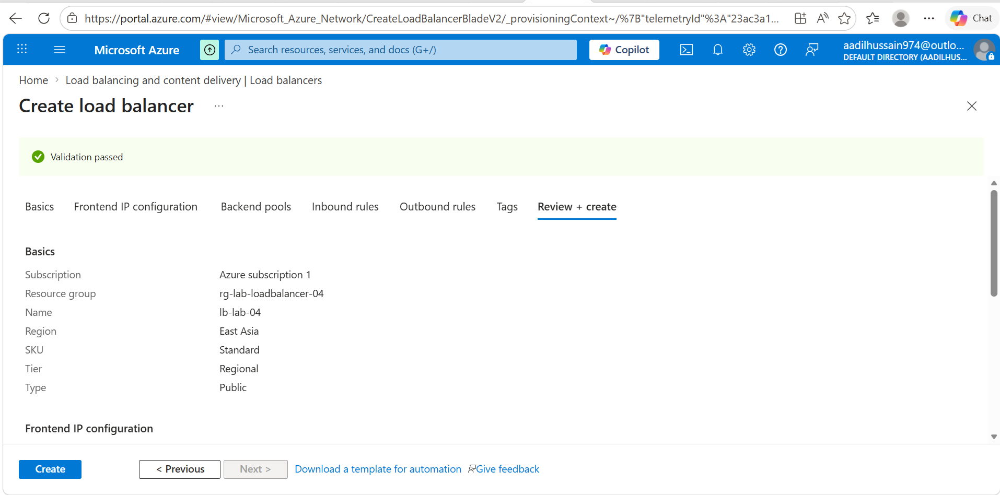
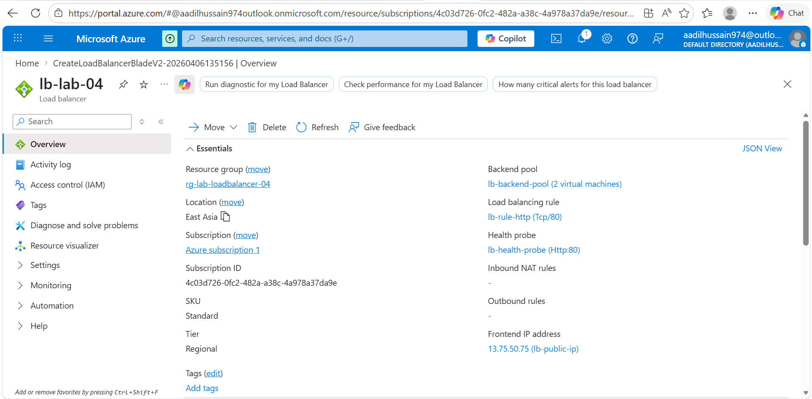
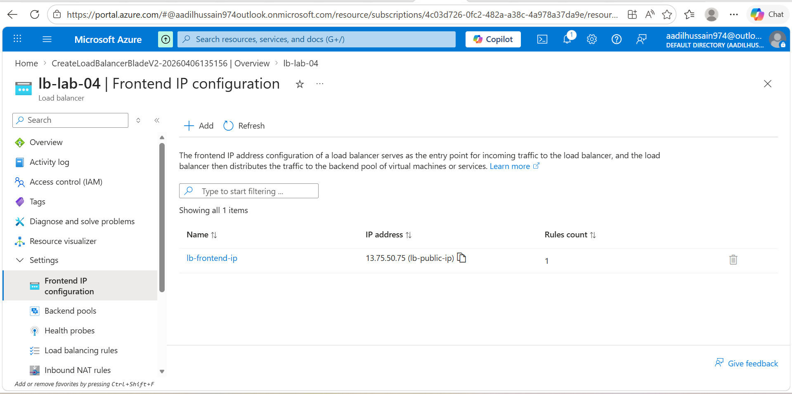

---

## Phase 4 — Test Load Balancing ✅ COMPLETED

### What I Did
- Got Load Balancer public IP 13.75.50.75 from Azure Portal
- Checked backend pool showing both VMs
- Checked load balancing rules configured correctly
- Discovered Nginx was not actually installed on VMs
- Added temporary public IP to VM-01 to allow internet access
- Successfully installed Nginx on VM-01 using Run Command
- Added temporary public IP to VM-02 and installed Nginx
- Removed temporary public IPs from both VMs after installation
- Opened http://13.75.50.75 in browser and saw custom page
- Refreshed multiple times to verify load balancing working
- Stopped VM-01 to test automatic failover to VM-02
- Confirmed all traffic automatically switched to VM-02
- Started VM-01 again and confirmed both VMs serving traffic
- Took all screenshots documenting the complete test

### Load Balancer Public IP
13.75.50.75

### Test Results
| Test | Expected Result | Actual Result |
|---|---|---|
| Open URL in browser | See VM-01 or VM-02 page | ✅ Saw custom page successfully |
| Refresh multiple times | Alternates between VMs | ✅ Load balancer distributed traffic |
| Stop VM-01 | All traffic goes to VM-02 | ✅ Automatic failover worked |
| Start VM-01 again | Both VMs serving traffic | ✅ Automatic recovery confirmed |

### Why Nginx Was Not Installed Initially
When VMs are created with no public IP they have
no outbound internet access by default in Azure.
The apt-get command could not reach ubuntu package
servers to download Nginx.
Error message was:
Could not connect to azure.archive.ubuntu.com:80
Connection timed out

### How I Fixed the Internet Access Problem
Added a temporary Standard public IP to each VM
through the Network Interface IP configuration page.
This gave the VM outbound internet access temporarily.
After Nginx was successfully installed the public IP
was removed again to keep VMs private and secure.
The Load Balancer still works because it uses the
internal private IPs of the VMs not public IPs.

### What High Availability Means in Practice
When VM-01 was stopped the Load Balancer health probe
detected it was not responding within 10 seconds.
Traffic was automatically redirected to VM-02 only.
No manual intervention was needed at any point.
When VM-01 restarted traffic resumed automatically.
Users visiting the website experienced zero downtime.
This is what high availability looks like in production.

### Round Robin Load Balancing Explained
Session persistence is set to None — round robin mode.
Request 1 → goes to VM-01
Request 2 → goes to VM-02
Request 3 → goes to VM-01
Request 4 → goes to VM-02
Each VM receives equal share of traffic automatically.
Modern browsers cache connections so private or
incognito windows show the switching more clearly.

### Problems I Faced
| Problem | What I Tried | How I Fixed It |
|---|---|---|
| Website not loading — connection timed out | Checked NSG rules | NSG was fine — Nginx was not installed |
| Nginx not installed — unit not found | Ran install command | Command failed — VM had no internet access |
| VM had no internet — no public IP | Tried apt-get update | Failed to connect to ubuntu archives |
| Cannot download packages without internet | Considered NAT Gateway | Added temporary public IP to VM for installation |
| Nginx install worked with temporary public IP | Verified with status | Removed temp public IP after installation |
| Browser caching showing same VM | Refreshed multiple times | Used incognito window to see proper switching |

### Architecture That Made This Work
Internet Users
↓
Load Balancer Public IP: 13.75.50.75
↓
Health Probe checks port 80 every 5 seconds
↓              ↓
VM-01           VM-02
Private IP      Private IP
10.0.1.x        10.0.1.x
Nginx running   Nginx running
Hello VM-01     Hello VM-02

### What I Learned
- VMs with no public IP have no outbound internet by default
- Temporary public IP can be added and removed from NIC
- NAT Gateway is the proper enterprise solution for this
- Load Balancer distributes traffic using round robin by default
- Health probe detects unhealthy VMs within seconds
- Failover is completely automatic — no manual steps needed
- Recovery is also automatic when VM comes back online
- Browser caching can make it appear same VM always responds
- Using incognito window bypasses browser connection caching
- Stopping a VM is a safe way to simulate server failure
- Standard Load Balancer works with Availability Sets
- This architecture eliminates single point of failure completely
- Real production environments use NAT Gateway not temp public IPs

### Screenshots

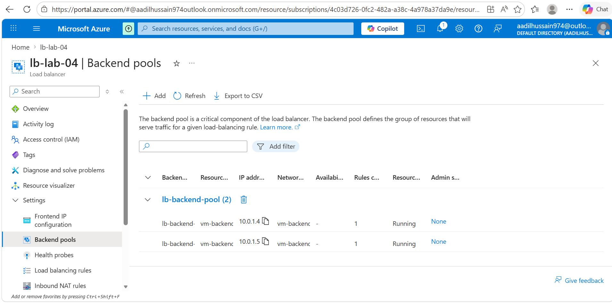
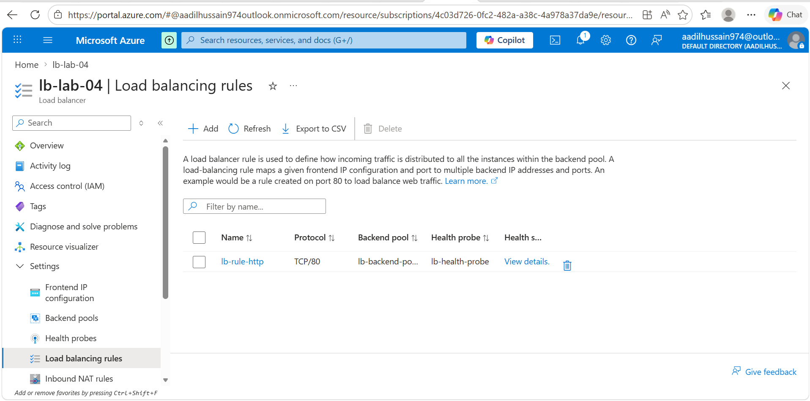


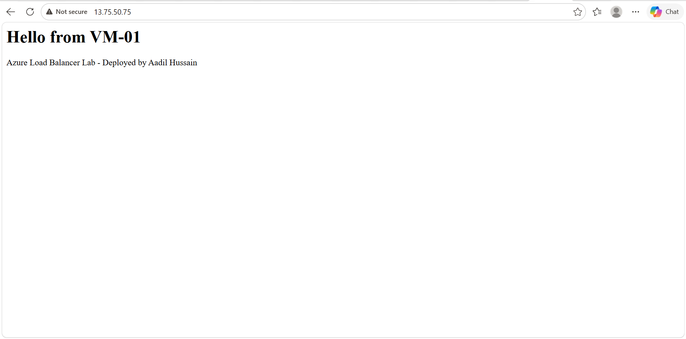

---

## Phase 5 — Cleanup
🔄 Not started yet

---

## Problems I Faced
| Problem | What I Tried | How I Fixed It |
|---|---|---|
| Write here | Write here | Write here |

---

## What I Learned
Fill at the end

---

## Cost Tracking
| Resource | Cost |
|---|---|
| VM 1 Standard_B2ats_v2 | ~$0.01/hr |
| VM 2 Standard_B2ats_v2 | ~$0.01/hr |
| Load Balancer Standard | ~$0.025/hr |
| Public IP | ~$0.004/hr |
| Total for 2 hr lab | ~$0.10 |

---

## My Confidence Rating After This Lab
| Skill | Before | After |
|---|---|---|
| Understanding load balancing | 1 | fill in |
| Creating Azure Load Balancer | 1 | fill in |
| Configuring backend pools | 1 | fill in |
| Setting up health probes | 1 | fill in |
| High availability concepts | 1 | fill in |

---

## What I Would Do Differently Next Time
Fill at the end