# Lab 05 — Azure Blob Storage
**Name:** Aadil Hussain
**Date Started:** 9 April 2026
**Date Completed:** 10 April 2026
**Total Time Taken:** [2 days]
**Status:** ✅ COMPLETED

---

## What I Am Building
An Azure Storage Account with Blob Storage containers
to store files securely in the cloud. I will upload
files, configure access levels, generate SAS tokens
for secure sharing, and host a static website directly
from Azure Blob Storage.

---

## Key Concepts

### What is Azure Blob Storage
Blob stands for Binary Large Object.
It stores unstructured data like images, videos,
documents, backups, and log files.
It is object storage — not a file system.
Files are stored as objects with metadata and a URL.
It is one of the cheapest storage options in Azure.

### Storage Account
The top level container for all Azure storage services.
One storage account can have multiple containers.
Storage account name must be globally unique.
Think of it like a hard drive in the cloud.

### Containers
A container is like a folder inside the storage account.
Each container holds blobs — the actual files.
Containers have access levels — private or public.
Private means only authorized users can access files.
Public means anyone with the URL can access files.

### SAS Token
SAS stands for Shared Access Signature.
It is a time-limited secure URL to share a file.
You control what permissions it has — read write delete.
You control when it expires — 1 hour 1 day 1 week.
The file stays private but the SAS URL works temporarily.

### Blob Tiers
Hot tier — frequently accessed data — higher cost
Cool tier — infrequently accessed — lower cost
Archive tier — rarely accessed — lowest cost
You can move blobs between tiers to save money.

### Static Website Hosting
Azure Blob Storage can serve HTML CSS JS files directly.
No web server needed — Azure handles everything.
You get a free URL like storageaccount.web.core.windows.net
Perfect for simple websites and documentation sites.

---

## Phase 1 — Create Storage Account ✅ COMPLETED

### What I Did
- Created resource group rg-lab-storage-05 in East Asia
- Navigated to Storage Accounts and clicked Create
- Named storage account aadilstorage05
- Selected Standard performance and LRS redundancy
- Enabled anonymous access on Advanced tab
- Left networking and data protection as default
- Reviewed and created the storage account
- Explored the storage account overview and services

### Settings I Used
| Field | Value |
|---|---|
| Resource group | rg-lab-storage-05 |
| Storage account name | aadilstorage05 |
| Region | East Asia |
| Performance | Standard |
| Redundancy | LRS — Locally Redundant Storage |
| Anonymous access | Enabled |
| TLS version | 1.2 |

### Storage Redundancy Options Explained
| Option | Copies | Where | Cost |
|---|---|---|---|
| LRS | 3 copies | Same data centre | Cheapest |
| ZRS | 3 copies | Different zones same region | Medium |
| GRS | 6 copies | Two different regions | Expensive |
| GZRS | 6 copies | Zones and regions | Most expensive |

### Why I Chose LRS
LRS is the cheapest redundancy option.
For a learning lab we do not need geo-redundancy.
LRS gives 99.999999999% durability — 11 nines.
That means 1 file loss per 100 billion files stored.
More than enough for lab purposes.

### Storage Account Services Available
| Service | Purpose |
|---|---|
| Blob storage | Unstructured files — images videos documents |
| File shares | SMB file shares — like network drives |
| Queues | Message queuing for app communication |
| Tables | NoSQL key-value storage |

### What I Learned
- Storage account is the top level container for all storage
- Name must be globally unique — only lowercase and numbers
- LRS is cheapest — keeps 3 copies in same data centre
- Performance Standard uses HDD — Premium uses SSD
- Anonymous access must be enabled at account level first
- Then it can be enabled at individual container level
- One storage account can host multiple storage services

### Screenshots
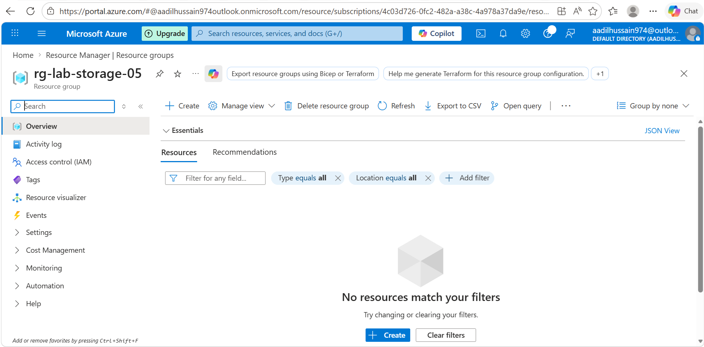
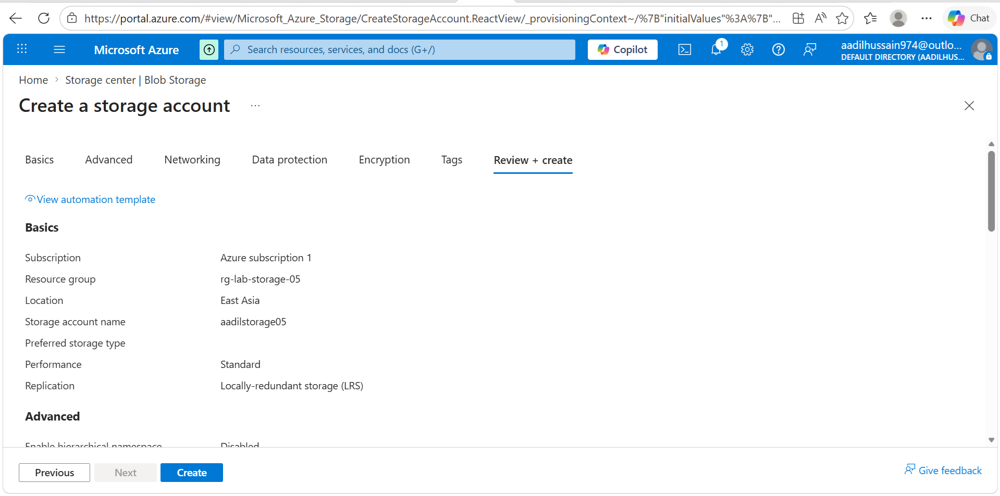
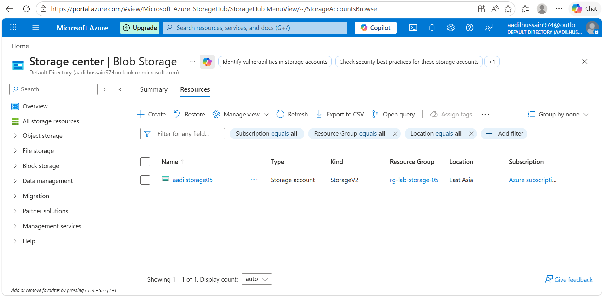
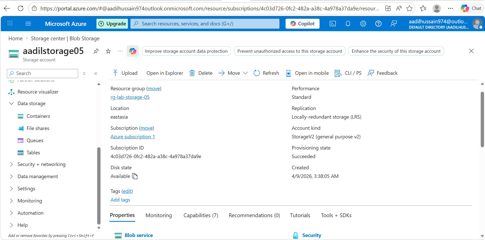

---

## Phase 2 — Create Containers and Upload Files ✅ COMPLETED

### What I Did
- Navigated to Containers under Data storage in sidebar
- Created lab-private container with Private access
- Created lab-public container with Blob anonymous access
- Created lab-uploads container with Private access
- Created 3 sample files in VS Code
- Uploaded sample-document.txt to lab-private
- Uploaded sample-data.json to lab-public
- Uploaded both files to lab-uploads
- Viewed blob properties including URL and metadata
- Tested public blob — accessible in browser directly
- Tested private blob — access denied as expected

### Containers Created
| Container | Access Level | Purpose |
|---|---|---|
| lab-private | Private | Secure storage — no public access |
| lab-public | Blob anonymous | Public files anyone can access |
| lab-uploads | Private | Upload staging area |

### Files Created and Uploaded
| File | Container | Type |
|---|---|---|
| sample-document.txt | lab-private and lab-uploads | Plain text |
| sample-data.json | lab-public and lab-uploads | JSON data |
| index.html | Used in Phase 4 for static website | HTML |

### Access Level Differences
| Level | Who Can Access | Use Case |
|---|---|---|
| Private | Only authorized users | Sensitive data |
| Blob | Anyone with URL | Public files images |
| Container | Anyone can list all blobs | Rarely used |

### Blob URL Format
https://[account].blob.core.windows.net/[container]/[blob]
https://aadilstorage05.blob.core.windows.net/lab-public/sample-data.json

### What I Learned
- Containers are like folders inside a storage account
- Access level is set per container not per blob
- Private containers return error to anonymous users
- Public blob containers allow direct URL access
- Blob URL format is always account container filename
- You can upload multiple files at once using Ctrl click
- Blob properties show size content type tier and URL
- Hot tier is default — for frequently accessed files

### Screenshots
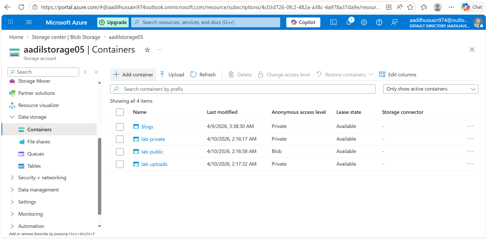
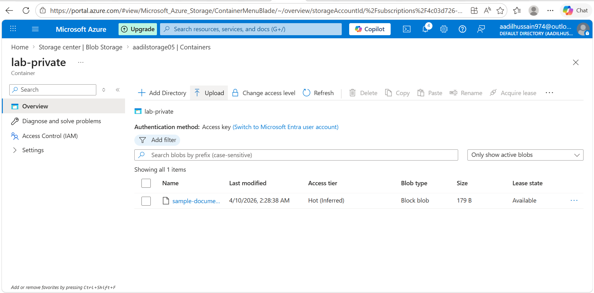
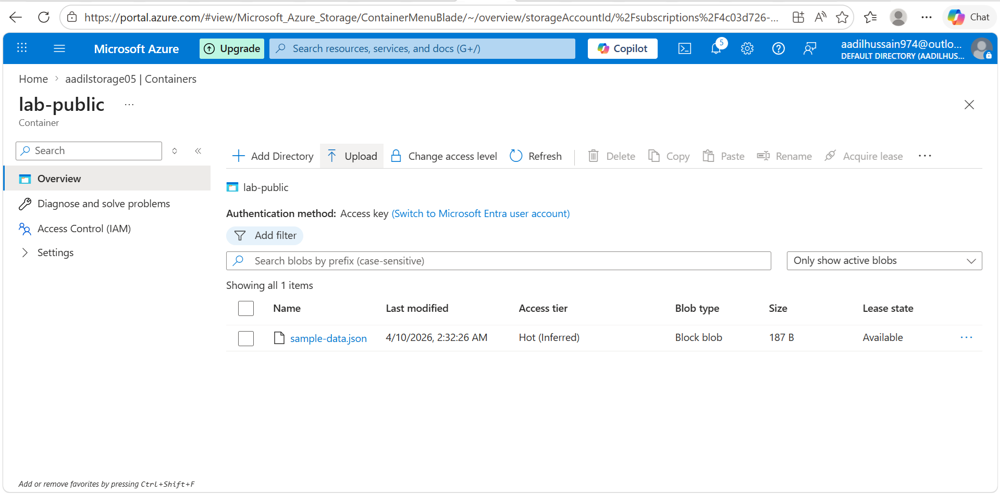
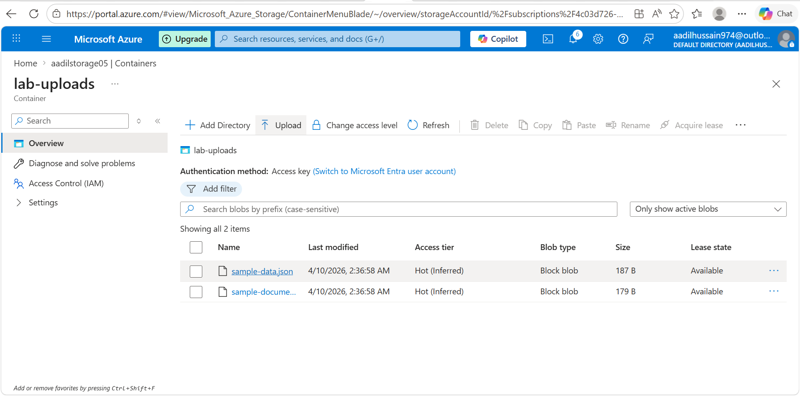
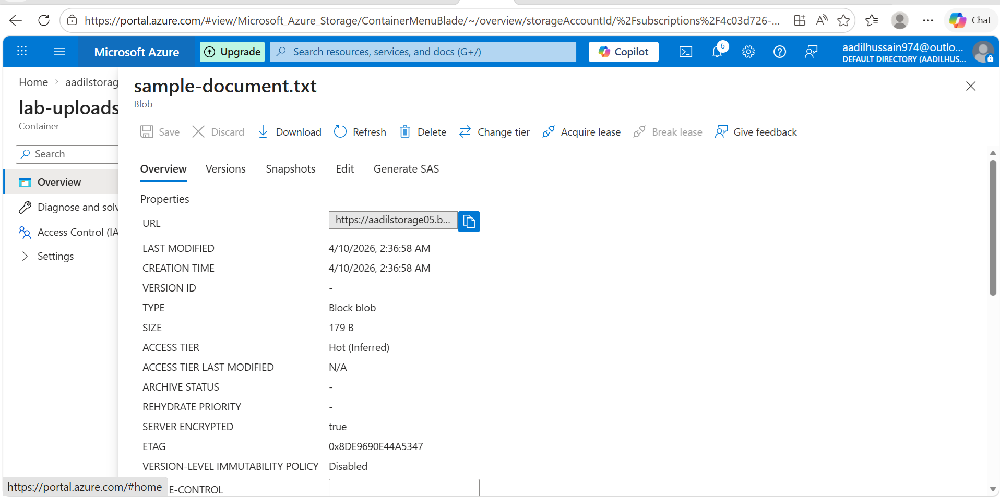
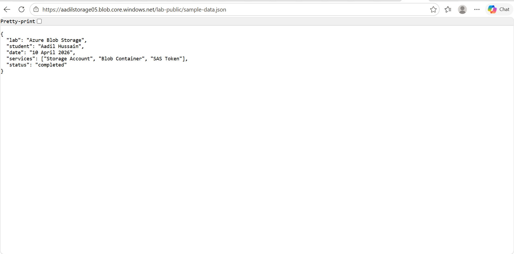
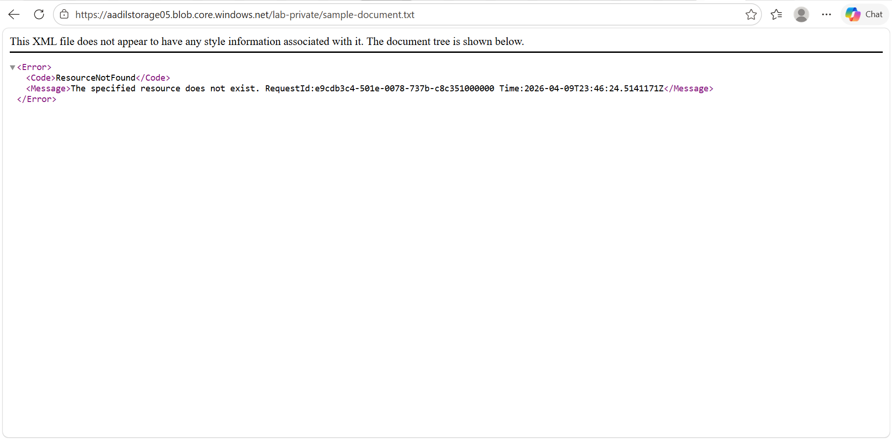

---

## Phase 3 — Configure Access and SAS Tokens ✅ COMPLETED

### What I Did
- Navigated to lab-uploads container
- Generated SAS token for sample-document.txt
- Set permissions to Read only and expiry to 1 hour
- Copied the Blob SAS URL
- Tested SAS URL in InPrivate browser — file accessible
- Modified SAS URL signature — got authentication failed
- Generated container level SAS token for lab-uploads
- Explored Access Control IAM for storage account
- Viewed Access Keys page — kept keys hidden
- Changed blob tier from Hot to Cool
- Changed blob tier back to Hot

### SAS Token Settings Used
| Field | Value |
|---|---|
| Signing method | Account key |
| Permissions | Read |
| Expiry | 1 hour from generation |
| Protocols | HTTPS only |

### SAS URL Format
https://aadilstorage05.blob.core.windows.net/
lab-uploads/
sample-document.txt
?sv=2023-01-03
&se=2026-04-05T...
&sp=r
&sig=XXXXXXXXXXXXXXXX

### SAS URL Parameters Explained
| Parameter | Meaning |
|---|---|
| sv | Storage version |
| se | Signed expiry time |
| sp | Signed permissions r=read w=write d=delete |
| sig | Cryptographic signature |

### Access Tiers Explained
| Tier | Use Case | Storage Cost | Access Cost |
|---|---|---|---|
| Hot | Frequently accessed | Highest | Lowest |
| Cool | Once per month | Medium | Medium |
| Cold | Once per 90 days | Lower | Higher |
| Archive | Rarely accessed | Lowest | Highest |

### Why SAS Tokens Are Better Than Public Access
Public container — anyone forever can access all files
SAS token — specific person specific file specific time
SAS token expires automatically — no cleanup needed
SAS token can be revoked by rotating account keys
SAS token permissions can be read only — very safe

### What I Learned
- SAS tokens provide time-limited access to private blobs
- SAS URL contains expiry time and cryptographic signature
- Changing one character in SAS invalidates it completely
- Container SAS gives access to all blobs in container
- Blob SAS gives access to one specific file only
- Access keys are master keys — never share or hardcode
- Use SAS tokens for sharing — never use access keys
- Blob tiers control storage cost vs access cost tradeoff
- Archive tier requires rehydration before accessing
- IAM roles provide long term access management

### Screenshots
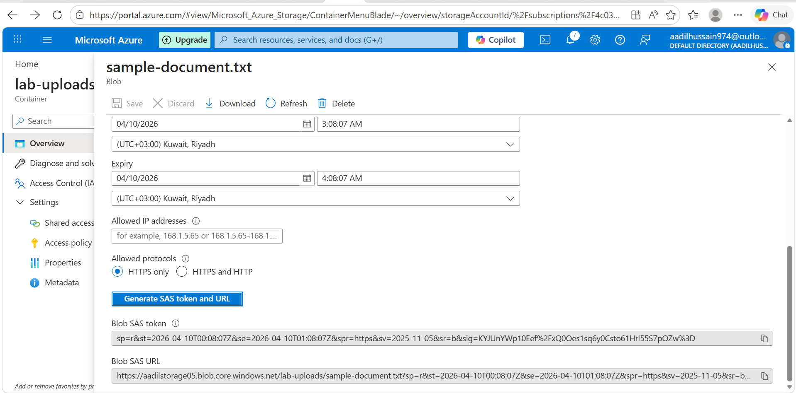
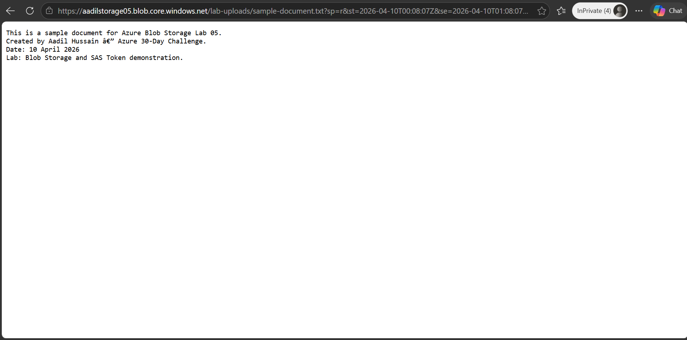
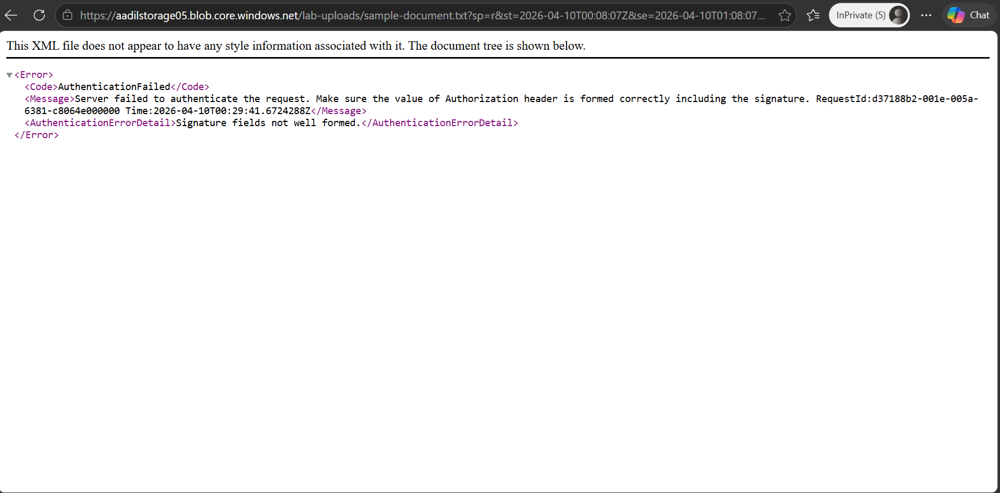
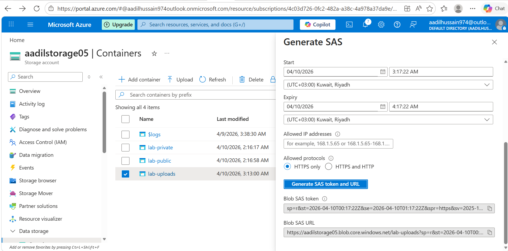
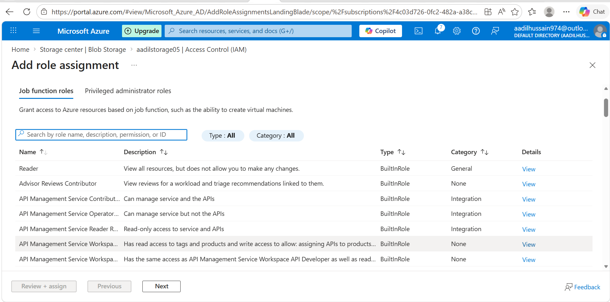
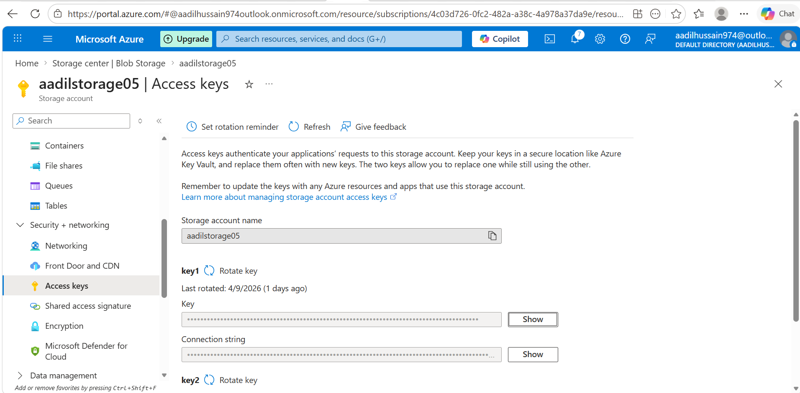
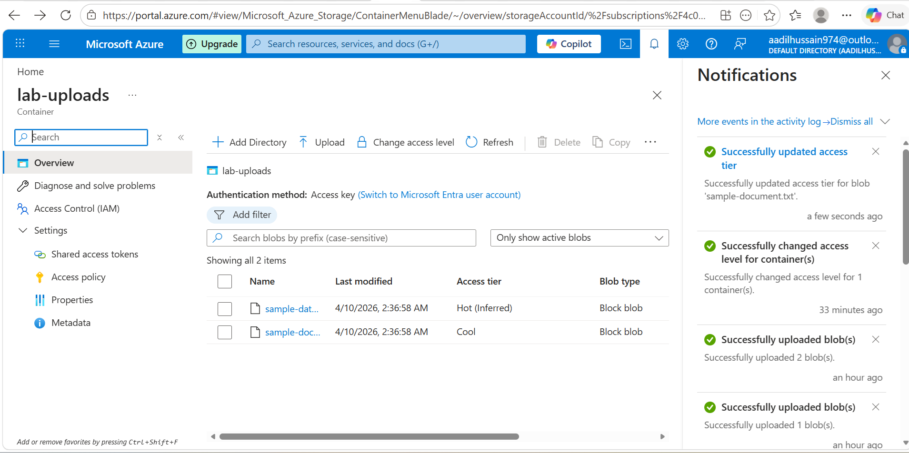

---

## Phase 4 — Static Website Hosting ✅ COMPLETED

### What I Did
- Navigated to Static website under Data management
- Enabled static website hosting
- Set index document to index.html
- Set error document to 404.html
- Saved settings and noted the primary endpoint URL
- Found the automatically created $web container
- Uploaded index.html to $web container
- Visited the primary endpoint URL in browser
- Saw my custom page live on the internet
- Created custom 404.html error page
- Uploaded 404.html to $web container
- Tested custom 404 page by visiting non-existent URL
- Explored Storage Metrics in Monitoring section

### Static Website Settings
| Field | Value |
|---|---|
| Status | Enabled |
| Index document | index.html |
| Error document | 404.html |
| Primary endpoint | https://aadilstorage05.z7.web.core.windows.net/ |

### Files Uploaded to $web Container
| File | Purpose |
|---|---|
| index.html | Main home page |
| 404.html | Custom error page |

### How Static Website Hosting Works
When enabled Azure creates a special $web container.
Any files uploaded to $web are served as website files.
Azure handles all the web serving automatically.
No Nginx no App Service no VM needed.
The URL format is always:
storageaccount.z[number].web.core.windows.net

### Comparison With Previous Labs
| Method | Lab | Server Needed | Cost |
|---|---|---|---|
| VM with Nginx | Lab 01 | Yes — managed by me | ~$0.01/hr |
| App Service | Lab 02 | No — managed by Azure | Free F1 |
| Blob Static Website | Lab 05 | No — serverless | ~$0.00 |

### What I Learned
- Static website hosting is enabled at storage account level
- Azure automatically creates $web container when enabled
- Only files in $web container are served as website
- Primary endpoint URL is provided automatically by Azure
- Custom 404 page improves user experience
- Blob Storage can host websites for almost zero cost
- Static hosting works for HTML CSS JS only
- Dynamic server-side code requires App Service or VM
- Storage metrics show request counts and bandwidth usage
- This is the cheapest way to host a simple website on Azure

### My Live Website URL
https://aadilstorage05.z23.web.core.windows.net/

### Screenshots
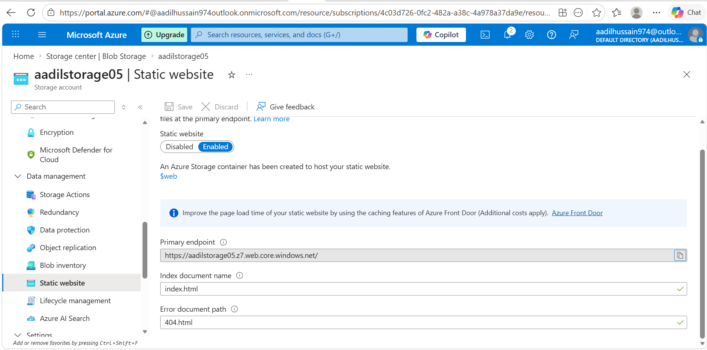
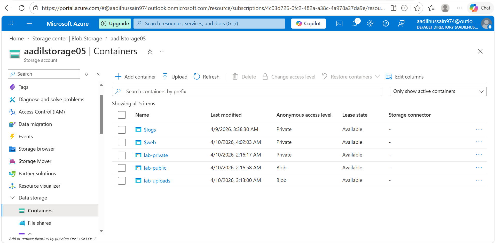
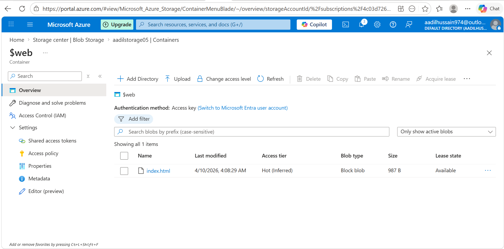
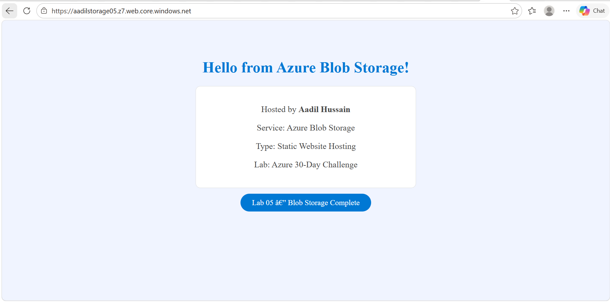
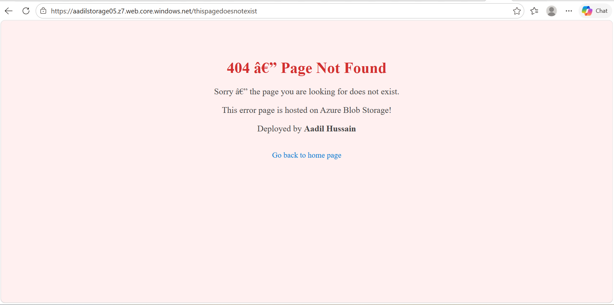
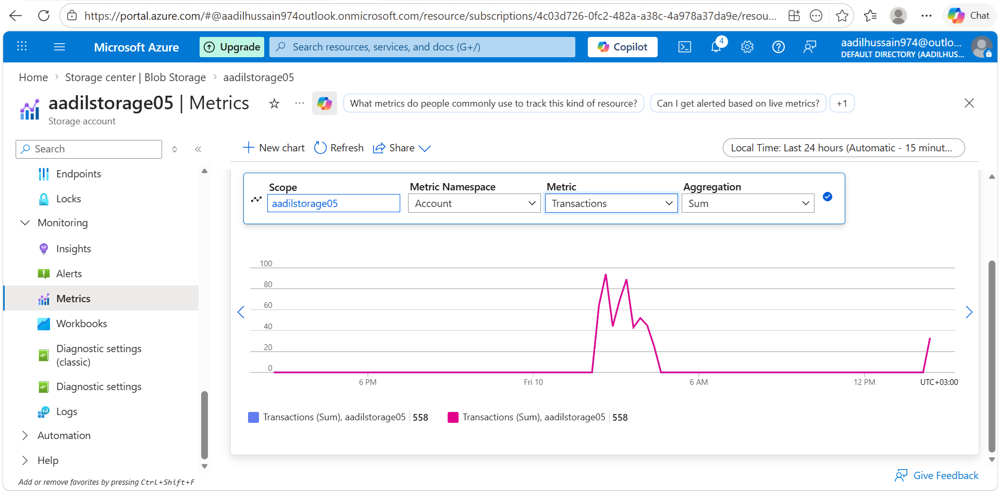

---

## Phase 5 — Cleanup ✅ COMPLETED

### What I Did
- Took final screenshots of containers and static website
- Took screenshot of all resources in resource group
- Clicked Delete resource group on rg-lab-storage-05
- Typed resource group name to confirm deletion
- Ticked confirmation checkbox
- Clicked red Delete button
- Waited 3 minutes for all resources to be deleted
- Confirmed rg-lab-storage-05 is gone from list
- Checked Cost Management for credit usage

### Resources Deleted
| Resource | Type |
|---|---|
| aadilstorage05 | Storage Account |
| All containers | lab-private lab-public lab-uploads $web |
| All uploaded files | sample-document.txt sample-data.json index.html 404.html |

### Cost This Lab Used
| Resource | Cost |
|---|---|
| Storage Account LRS | Less than $0.01 |
| Blob operations | Fractions of a cent |
| Static website hosting | Free |
| Total | ~$0.01 |

### What I Learned
- Storage Account deletion removes all containers and blobs
- Static website hosting is disabled when account is deleted
- Blob Storage is extremely cheap for learning labs
- Always delete storage accounts after labs to stay clean
- Even free tier resources should be cleaned up regularly

### Screenshots
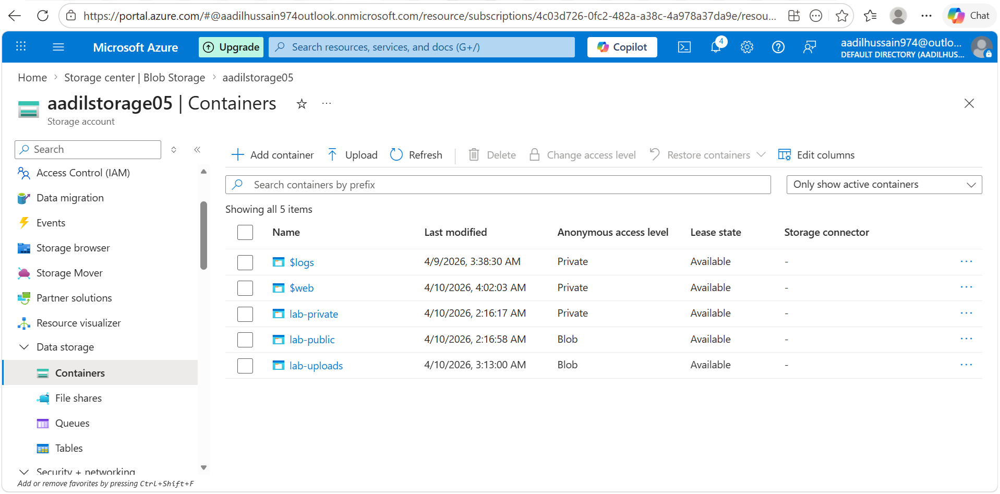
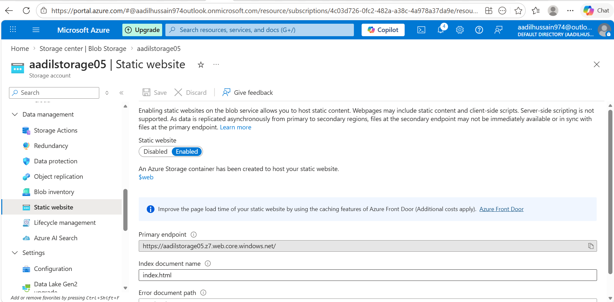
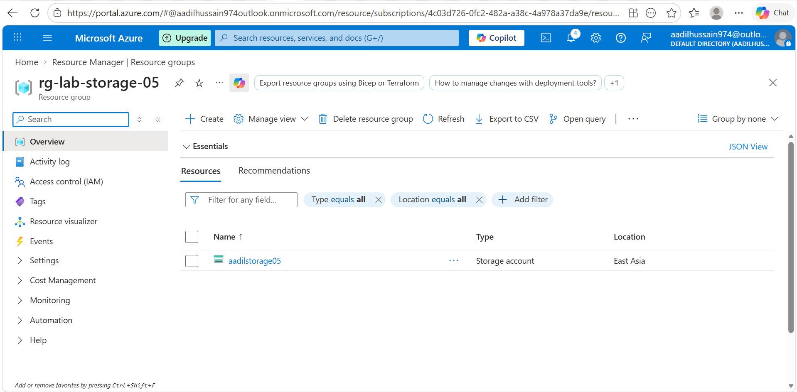
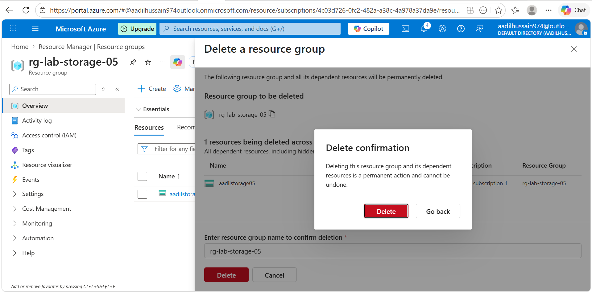
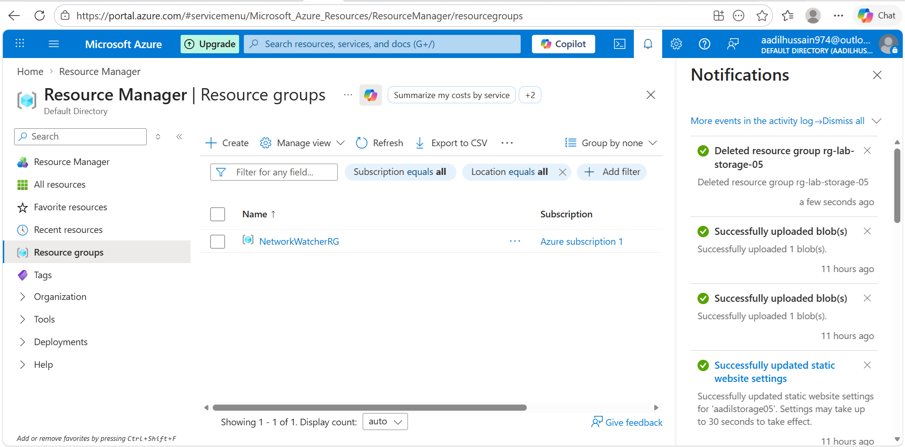
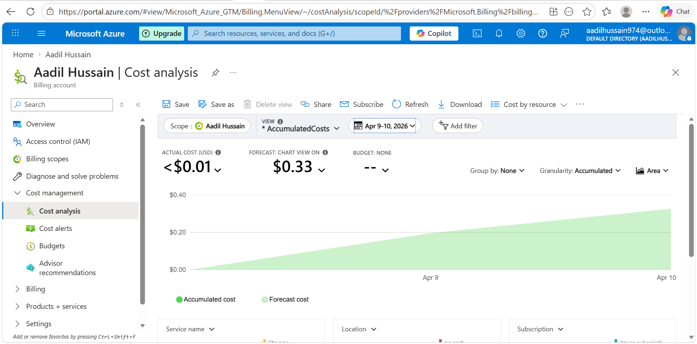

---

## Problems I Faced
| Problem | What I Tried | How I Fixed It |
|---|---|---|
| ReactView frame failed to load when creating storage account | Clicked Refresh button on error page | Hard refreshed with Ctrl+Shift+R and portal loaded correctly |
| SAS token URL showing AuthenticationFailed error | Tested URL in InPrivate window multiple times | Generated SAS from inside blob properties tab not container level — $root was wrong path |
| SAS URL contained $root instead of lab-uploads path | Regenerated SAS from container level | Navigated inside blob → clicked Generate SAS tab at top of blob properties |
| Static website URL showing DNS_PROBE_FINISHED_NXDOMAIN | Typed URL manually from memory | Copied exact primary endpoint URL from Static website settings page |
| 404 page not showing custom error page | Visited non-existent URL | Verified 404.html was uploaded to $web container and error document path was set correctly |
| Confusion between container SAS and blob SAS | Generated from different places | Blob SAS is for one specific file — container SAS is for all files in container |

---

## What I Learned
- Storage Account is the top level container for all storage
- Blob Storage stores unstructured files as objects with URLs
- LRS redundancy keeps 3 copies in same data centre cheaply
- Containers control access — private or public per container
- SAS tokens provide time-limited secure access to private files
- SAS token has expiry time and cryptographic signature
- Changing one character in SAS makes it completely invalid
- Access keys are master keys — never share or hardcode them
- Blob tiers — Hot Cool Cold Archive — control cost vs speed
- Static website hosting serves HTML directly from $web container
- Azure creates $web container automatically when enabled
- Custom 404 pages improve user experience
- Blob Storage is the cheapest way to host a static website
- Storage metrics show requests and bandwidth usage

---

## Cost Tracking
| Resource | Cost |
|---|---|
| Storage Account LRS | ~$0.002 per GB per month |
| Blob storage operations | Fractions of a cent |
| Static website hosting | Free |
| Total for lab | ~$0.01 |

---

## My Confidence Rating After This Lab
| Skill | Before | After |
|---|---|---|
| Understanding Blob Storage | 1 | 4 |
| Creating Storage Accounts | 1 | 4 |
| Managing containers and blobs | 1 | 4 |
| Generating SAS tokens | 1 | 4 |
| Static website hosting | 1 | 3 |

---

## What I Would Do Differently Next Time
1. Copy the exact primary endpoint URL from Static website
   page before testing to avoid DNS errors
2. Test SAS token immediately after generating while fresh
3. Generate SAS from inside the blob properties page
   not from container level to avoid $root errors
4. Upload all files to $web before enabling static website
5. Set up lifecycle management policies to auto-move
   blobs from Hot to Cool after 30 days to save costs