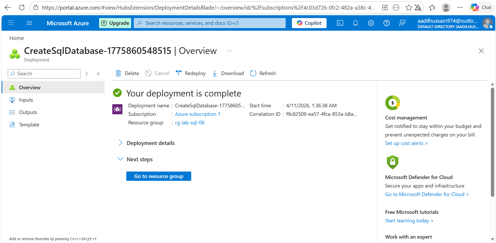
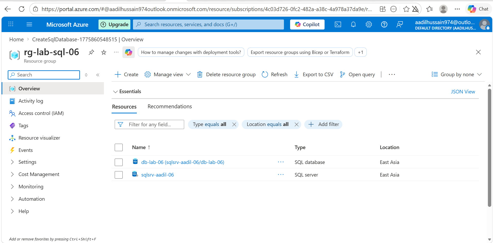
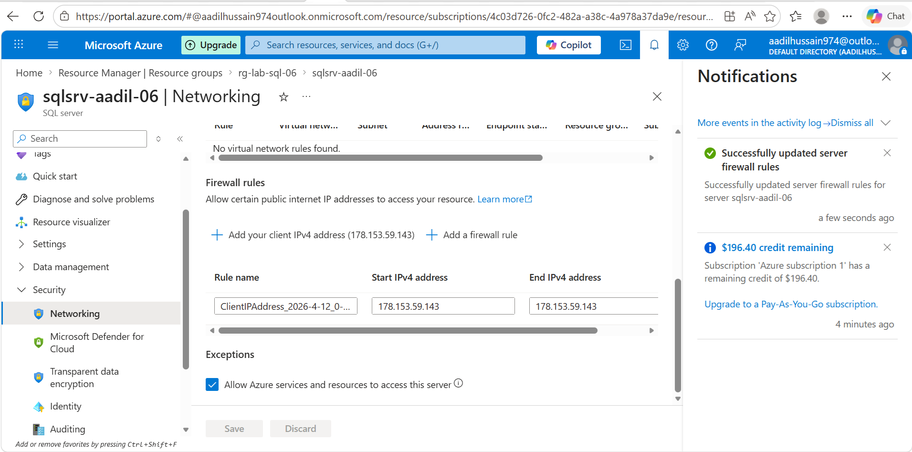
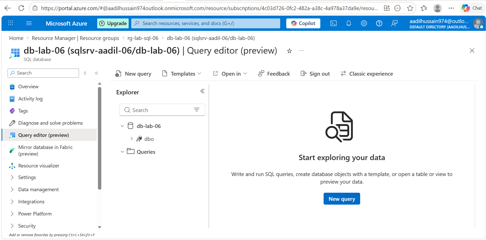
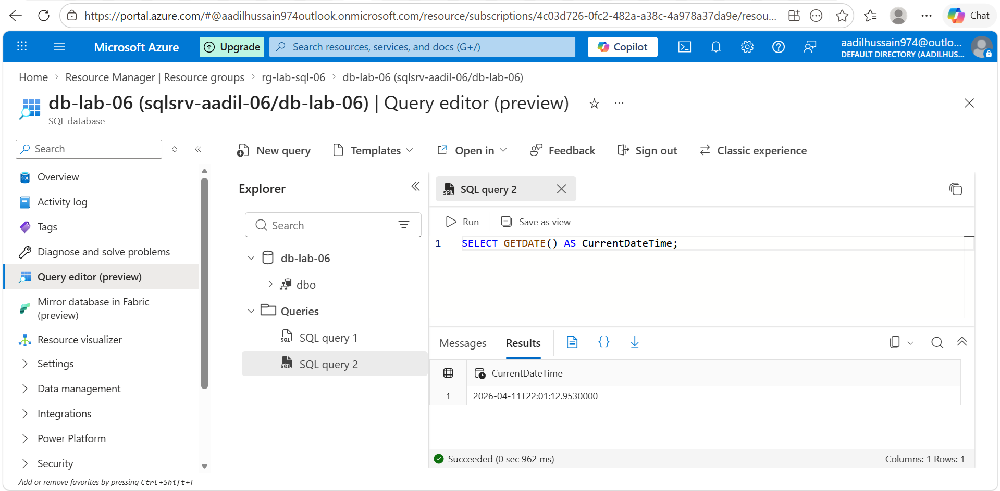
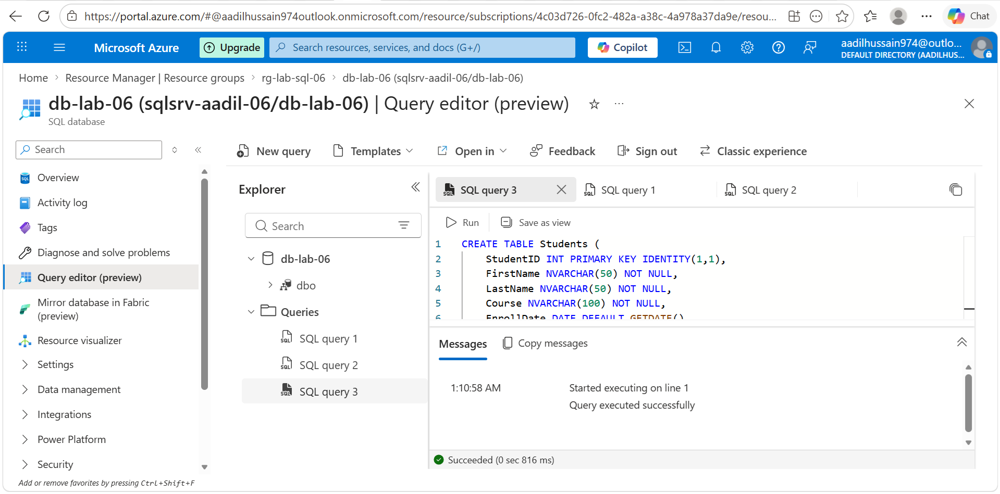
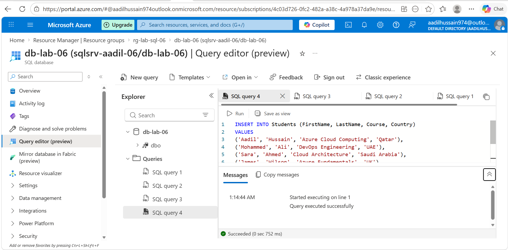
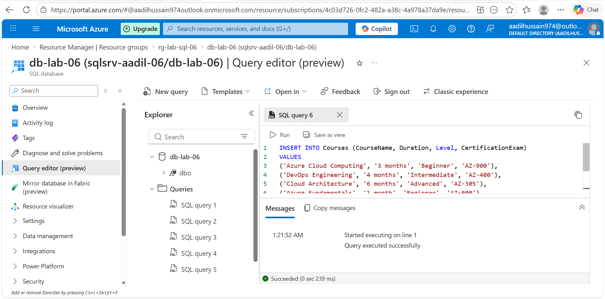
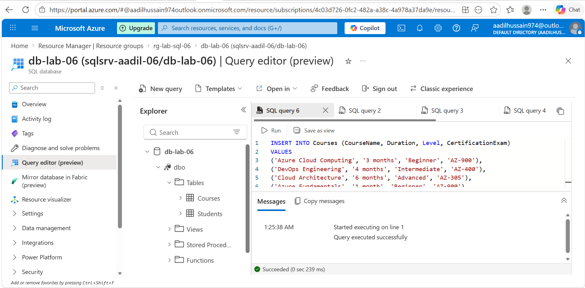

# Lab 06 — Azure SQL Database
**Name:** Aadil Hussain
**Date Started:** 11 April 2026
**Status:** 🔄 In Progress

---

## What I Am Building
A managed Azure SQL Database with a logical SQL Server.
I will create tables, insert data, run queries using
the Azure Portal Query Editor, and configure firewall
rules to control access.

---

## Key Concepts

### What is Azure SQL Database
A fully managed relational database service in Azure.
Microsoft handles patching backups and high availability.
You just create tables and run queries — no OS management.
It is PaaS — Platform as a Service for databases.

### SQL Server vs SQL Database
SQL Server is the logical container — like a building.
SQL Database is the actual database — like a room.
One SQL Server can host multiple SQL Databases.

### DTU vs vCore
DTU — Database Transaction Unit — simple pricing model.
Basic tier uses DTUs — cheapest option for learning.
vCore — more control over CPU and memory — more expensive.
For labs always use Basic DTU tier.

### Firewall Rules
By default no one can connect to Azure SQL Database.
You must add your IP address to the firewall rules.
This prevents unauthorized access from anywhere.

---

## Phase 1 — Create SQL Server and Database ✅ COMPLETED
### What I Did
- Created resource group rg-lab-sql-06 in East Asia
- Navigated to SQL databases and clicked Create
- Selected SQL Database free offer option
- Created new SQL Server sqlsrv-aadil-06 with SQL authentication
- Set admin login as sqladmin with strong password
- Left compute and storage as free offer defaults
- Selected locally redundant backup storage
- Enabled public endpoint and added client IP address
- Waited 5 minutes for deployment to complete
- Clicked Go to resource and explored overview page

### Settings I Used
| Field | Value |
|---|---|
| Resource group | rg-lab-sql-06 |
| Database offer | SQL Database free offer |
| Database name | db-lab-06 |
| Server name | sqlsrv-aadil-06 |
| Location | East Asia |
| Auth method | SQL authentication |
| Admin login | sqladmin |
| Password | P@ssw0rd123! |
| Compute tier | Free offer default |
| Backup redundancy | Locally redundant |
| Connectivity | Public endpoint |

### Free Offer vs Paid Tiers
| Option | Cost | Storage | Best For |
|---|---|---|---|
| Free offer | $0.00 | 32 GB | Learning and development |
| Basic 5 DTU | ~$0.02/hr | 2 GB | Small production apps |
| Standard S0 | ~$0.10/hr | 250 GB | Medium apps |
| Premium P1 | ~$0.93/hr | 500 GB | High performance apps |

### Why I Chose Free Offer
The free offer is completely free for 12 months.
It provides full SQL functionality for learning.
Only one free database allowed per subscription.
Perfect for lab purposes — zero cost to my credit.
No DTU configuration needed — Azure handles it.

### SQL Server vs SQL Database Explained
SQL Server is the logical server — like a building.
It holds the admin credentials and firewall rules.
SQL Database is the actual database — like a room.
One SQL Server can host multiple SQL Databases.
Deleting the resource group removes both together.

### What I Learned
- Azure SQL Database is fully managed PaaS database
- Free offer gives complete SQL functionality at zero cost
- SQL Server is logical container — not a physical server
- Basic authentication uses username and password
- Public endpoint allows browser-based Query Editor access
- Locally redundant backup keeps copies in same data centre
- Microsoft handles all patching backups and high availability
- Free offer is limited to one database per subscription

### Screenshots



---

## Phase 2 — Configure Firewall and Connect ✅ COMPLETED

### What I Did
- Navigated to SQL Server sqlsrv-aadil-06 from database overview
- Opened Networking under Security in left sidebar
- Enabled public network access for selected networks
- Added my client IPv4 address to firewall rules
- Ticked Allow Azure services and resources checkbox
- Saved firewall settings successfully
- Went back to SQL Database db-lab-06
- Opened Query Editor from left sidebar
- Logged in with sqladmin and password
- Ran test query SELECT GETDATE() to verify connection
- Confirmed database is working correctly

### Firewall Settings Configured
| Setting | Value |
|---|---|
| Public network access | Selected networks enabled |
| Client IP address | Added automatically |
| Allow Azure services | Yes — ticked |

### Why Each Firewall Setting Matters
| Setting | Why Needed |
|---|---|
| Public network access | Allows connections from internet |
| Client IP address | Allows your specific PC to connect |
| Allow Azure services | Allows Query Editor in portal to connect |

### Test Query Run
```sql
SELECT GETDATE() AS CurrentDateTime;
```
Result: Current date and time confirmed connection working

### What I Learned
- Azure SQL blocks ALL connections by default for security
- Three separate settings needed for full access
- Client IP must be added explicitly — not automatic
- Allow Azure services enables browser based Query Editor
- Query Editor is free built in browser SQL tool
- GETDATE is T-SQL function returning current timestamp
- Connection confirmed before moving to next phase

### Screenshots




---

## Phase 3 — Create Tables and Insert Data ✅ COMPLETED

### What I Did
- Opened Query Editor in Azure Portal
- Created Students table with 6 columns
- Inserted 8 student records from different countries
- Created Courses table with 5 columns
- Inserted 8 course records with certification details
- Verified both tables visible in left panel tree view
- Confirmed all queries showed success messages

### Tables Created
| Table | Columns | Rows Inserted |
|---|---|---|
| Students | StudentID FirstName LastName Course EnrollDate Country | 8 |
| Courses | CourseID CourseName Duration Level CertificationExam | 8 |

### SQL Commands Used
| Command | Purpose |
|---|---|
| CREATE TABLE | Creates new table structure in database |
| INT PRIMARY KEY IDENTITY | Auto-incrementing unique ID column |
| NVARCHAR(50) | Variable length text up to 50 characters |
| NOT NULL | Field must always have a value |
| DEFAULT GETDATE() | Auto fills current date on insert |
| INSERT INTO | Adds new rows to existing table |
| VALUES | Specifies the actual data to insert |

### Data Inserted Into Students
| StudentID | Name | Course | Country |
|---|---|---|---|
| 1 | Aadil Hussain | Azure Cloud Computing | Qatar |
| 2 | Mohammed Ali | DevOps Engineering | UAE |
| 3 | Sara Ahmed | Cloud Architecture | Saudi Arabia |
| 4 | James Wilson | Azure Fundamentals | UK |
| 5 | Fatima Khan | Cybersecurity | Pakistan |
| 6 | Carlos Rodriguez | Data Engineering | Spain |
| 7 | Priya Sharma | Machine Learning | India |
| 8 | Ahmed Hassan | Network Engineering | Egypt |

### What I Learned
- Query Editor runs T-SQL directly in browser no software needed
- CREATE TABLE defines structure before data can be inserted
- IDENTITY auto-increments primary key — no need to specify ID
- DEFAULT GETDATE fills enrollment date automatically on insert
- NOT NULL prevents empty values in required fields
- Multiple rows inserted in single INSERT statement efficiently
- Tables appear in left panel tree view after creation
- dbo prefix means database owner — default schema in SQL Server

### Screenshots





---

## Phase 4 — Query and Explore
🔄 Not started yet

---

## Phase 5 — Cleanup
🔄 Not started yet

---

## Problems I Faced
| Problem | What I Tried | How I Fixed It |
|---|---|---|
| Write here | Write here | Write here |

---

## What I Learned
Fill at the end

---

## Cost Tracking
| Resource | Cost |
|---|---|
| SQL Server | Free — logical container only |
| SQL Database Basic 5 DTU | ~$0.02/hr |
| Total for 90 min lab | ~$0.03 |

---

## My Confidence Rating After This Lab
| Skill | Before | After |
|---|---|---|
| Understanding managed databases | 1 | fill in |
| Creating Azure SQL resources | 1 | fill in |
| Writing SQL queries | 1 | fill in |
| Configuring firewall rules | 1 | fill in |
| Using Query Editor | 1 | fill in |

---

## What I Would Do Differently Next Time
Fill at the ends