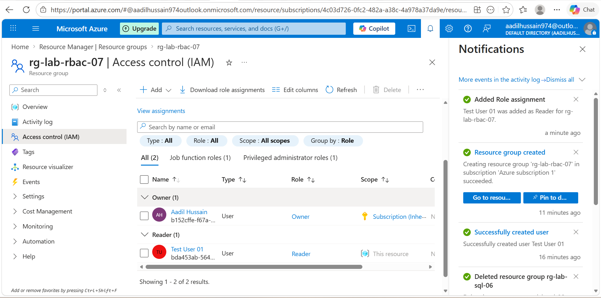
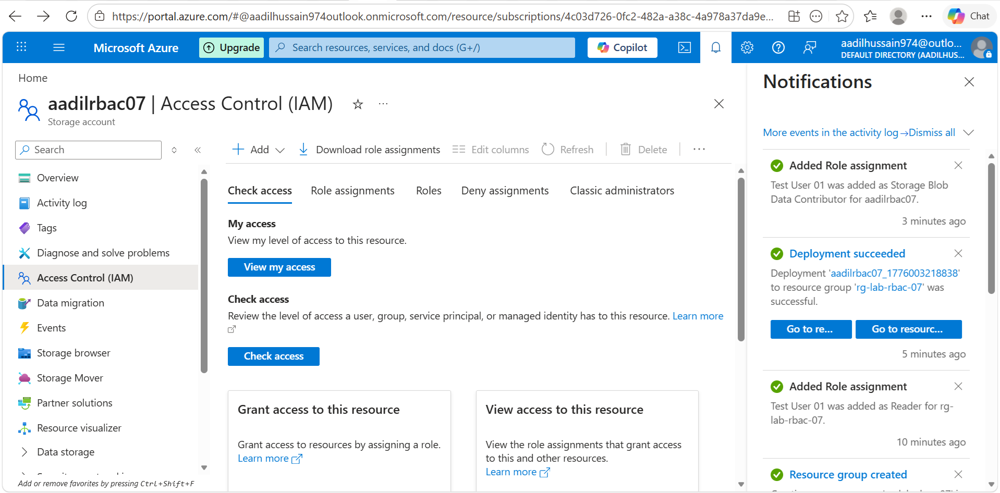
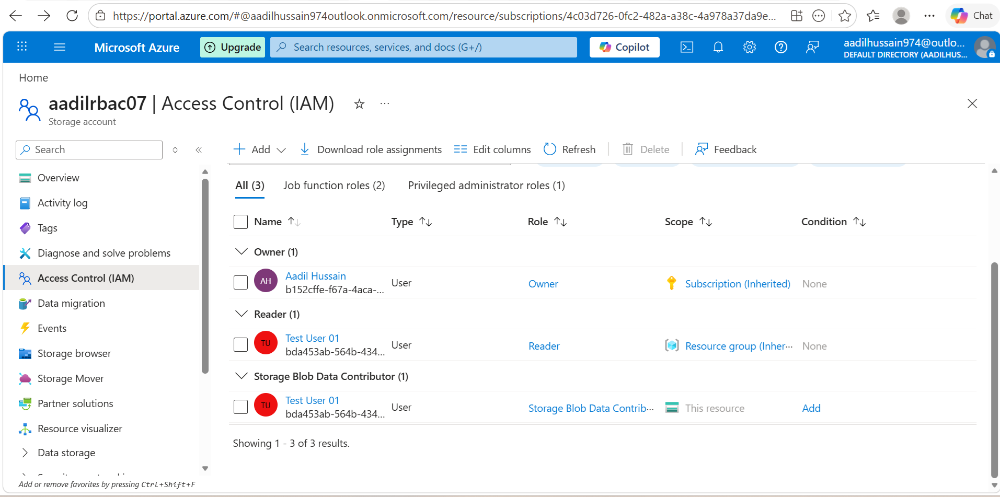
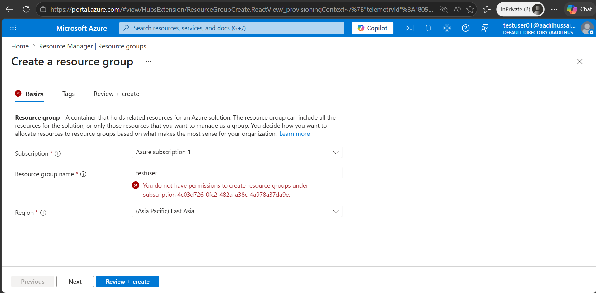
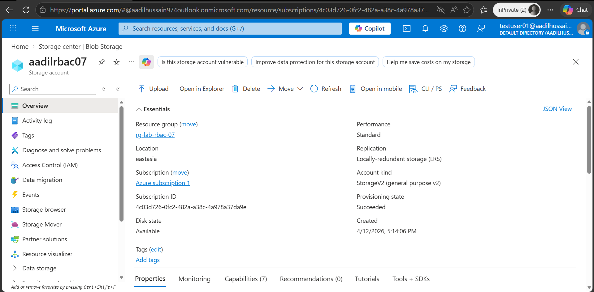

# Lab 07 — Azure RBAC and Identity Management
**Name:** Aadil Hussain
**Date Started:** 12 April 2026
**Date Completed:** in progress
**Total Time Taken:** [fill in]
**Status:** 🔄 In Progress

---

## What I Am Building
Demonstrating Azure Role Based Access Control by creating
a test user in Microsoft Entra ID assigning roles at
different scopes and verifying the principle of least
privilege in action.

---

## Key Concepts

### What is RBAC
Role Based Access Control controls who can do what
on which Azure resources.
Every RBAC assignment has three parts:
Security Principal — WHO gets access
Role Definition — WHAT they can do
Scope — WHERE the access applies

### Built in Roles
Owner — full control including access management
Contributor — create and manage but cannot grant access
Reader — view only — cannot make any changes
User Access Administrator — manage user access only

### Scope Levels
Management Group — highest level — multiple subscriptions
Subscription — all resource groups and resources
Resource Group — all resources in the group
Resource — single specific resource only

### Principle of Least Privilege
Always grant the minimum access needed.
A reader cannot accidentally delete resources.
A contributor cannot grant others dangerous permissions.
This reduces security risk significantly.

### Microsoft Entra ID
Formerly known as Azure Active Directory.
It is Azure's identity and access management service.
Used to create and manage users and groups.
Every Azure subscription has one Entra ID tenant.

---

## Phase 1 — Create Test User in Entra ID ✅ COMPLETED

### What I Did
- Navigated to Microsoft Entra ID in Azure Portal
- Clicked Users under Manage section
- Created new user testuser01 with auto generated password
- Noted the temporary password for later use
- Created resource group rg-lab-rbac-07 in East Asia

### User Settings Created
| Field | Value |
|---|---|
| User principal name | testuser01@[yourdomain].onmicrosoft.com |
| Display name | Test User 01 |
| Password | Auto generated temporary password |
| Account status | Enabled |

### What is Microsoft Entra ID
Microsoft Entra ID is Azure's identity service.
Every Azure subscription has one Entra ID tenant.
Users created here can be assigned Azure resource access.
It was previously called Azure Active Directory.
The free tier supports unlimited users and groups.

### What I Learned
- Microsoft Entra ID manages identities for Azure resources
- Every user gets a UPN in format name@domain.onmicrosoft.com
- Auto generated passwords are temporary — user must change on login
- Entra ID free tier is completely free with full user management
- Creating a user does not give them any Azure access by default
- Access must be explicitly assigned using RBAC role assignments

### Screenshots

---

## Phase 2 — Assign RBAC Roles ✅ COMPLETED

### What I Did
- Navigated to rg-lab-rbac-07 Access Control IAM
- Added Reader role assignment for Test User 01
- Created storage account aadilrbac07 for resource level test
- Assigned Storage Blob Data Contributor role on storage account
- Viewed all role assignments in the IAM Role assignments tab

### Role Assignments Made
| User | Role | Scope | Level |
|---|---|---|---|
| Test User 01 | Reader | rg-lab-rbac-07 | Resource Group |
| Test User 01 | Storage Blob Data Contributor | aadilrbac07 | Resource |

### RBAC Assignment Components
| Component | Description | Example |
|---|---|---|
| Security Principal | WHO gets access | Test User 01 |
| Role Definition | WHAT they can do | Reader — view only |
| Scope | WHERE access applies | rg-lab-rbac-07 |

### Built In Roles Used
| Role | Permissions | Use Case |
|---|---|---|
| Reader | View all resources | Auditors monitoring teams |
| Storage Blob Data Contributor | Read write delete blobs | App developers |
| Contributor | Create manage resources | Developers |
| Owner | Full control plus access management | Administrators |

### What I Learned
- RBAC assignments have three parts — principal role scope
- Reader role allows viewing but not changing anything
- Roles can be assigned at different scope levels
- Resource level assignment overrides for that specific resource
- Multiple roles can be assigned to same user at different scopes
- IAM Access Control page shows all assignments clearly
- Role assignments take effect within a few minutes

### Screenshots

---

## Phase 3 — Test Access as Test User ✅ COMPLETED

### What I Did
- Opened InPrivate Edge window to simulate different user
- Signed in as testuser01 with temporary password
- Changed temporary password on first login
- Navigated to rg-lab-rbac-07 resource group
- Tried to create a resource — got permission denied
- Confirmed user can VIEW resources but not create them
- Signed out Test User 01 from InPrivate window

### Test Results
| Action | Expected | Actual | Result |
|---|---|---|---|
| View resource group | Allowed — Reader | Could see rg-lab-rbac-07 | ✅ Pass |
| View storage account | Allowed — Reader | Could see aadilrbac07 | ✅ Pass |
| Create new resource | Denied — Reader | Permission denied error | ✅ Pass |
| Delete resource | Denied — Reader | Not possible | ✅ Pass |

### What Principle of Least Privilege Means in Practice
Test User 01 has Reader role only.
They can see everything in the resource group.
They cannot create delete or modify anything.
This means even if their account is compromised
an attacker cannot damage or delete resources.
This is the principle of least privilege working correctly.

### What I Learned
- InPrivate window allows testing as different user
- Temporary passwords must be changed on first login
- Reader role truly restricts to view only access
- Permission denied appears when trying to create
- RBAC roles take effect immediately after assignment
- Testing role assignments verifies security is working
- Least privilege reduces blast radius of compromised accounts

### Screenshots

---

## Phase 4 — Explore Role Definitions
🔄 Not started yet

---

## Phase 5 — Cleanup
🔄 Not started yet

---

## Problems I Faced
| Problem | What I Tried | How I Fixed It |
|---|---|---|
| Write here | Write here | Write here |

---

## What I Learned
Fill at the end

---

## Cost Tracking
| Resource | Cost |
|---|---|
| Microsoft Entra ID Free | $0.00 |
| RBAC assignments | $0.00 |
| Resource Group | $0.00 |
| Total | $0.00 |

---

## My Confidence Rating After This Lab
| Skill | Before | After |
|---|---|---|
| Understanding RBAC concepts | 1 | fill in |
| Creating Entra ID users | 1 | fill in |
| Assigning roles at different scopes | 1 | fill in |
| Verifying least privilege | 1 | fill in |
| Understanding role definitions | 1 | fill in |

---

## What I Would Do Differently Next Time
Fill at the end