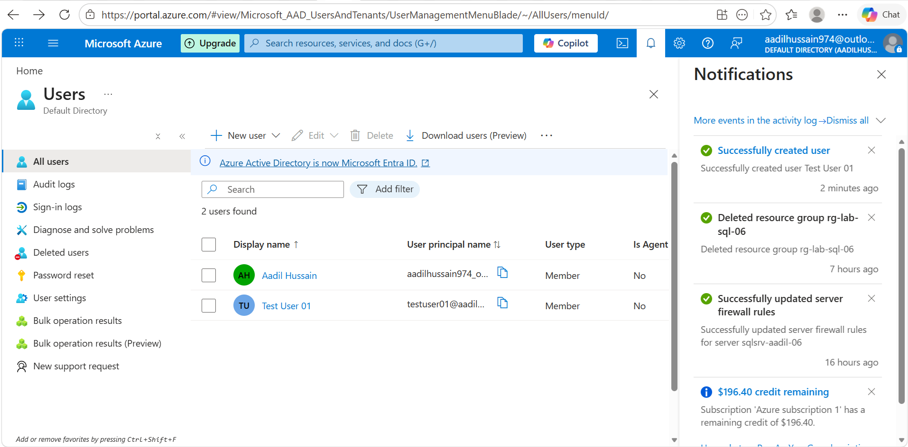
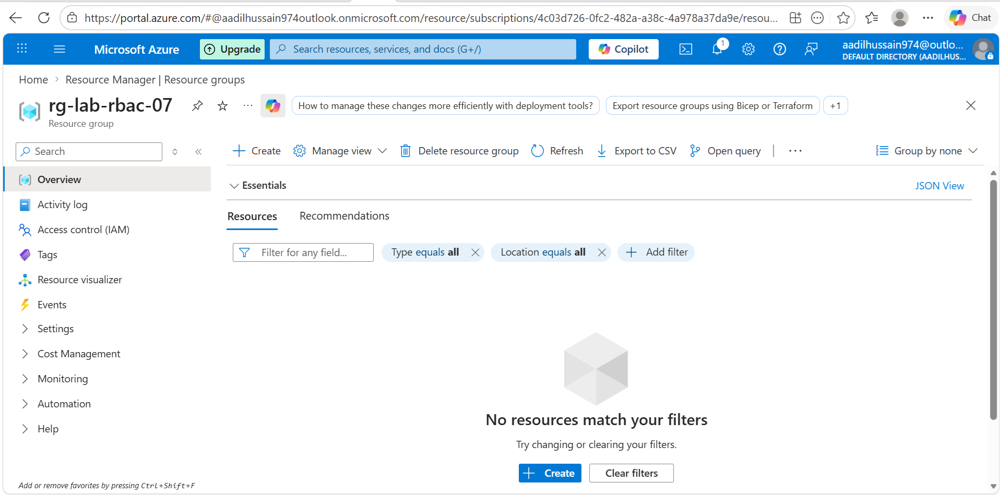

# Lab 07 — Azure RBAC and Identity Management
**Name:** Aadil Hussain
**Date Started:** 12 April 2026
**Date Completed:** in progress
**Total Time Taken:** [fill in]
**Status:** 🔄 In Progress

---

## What I Am Building
Demonstrating Azure Role Based Access Control by creating
a test user in Microsoft Entra ID assigning roles at
different scopes and verifying the principle of least
privilege in action.

---

## Key Concepts

### What is RBAC
Role Based Access Control controls who can do what
on which Azure resources.
Every RBAC assignment has three parts:
Security Principal — WHO gets access
Role Definition — WHAT they can do
Scope — WHERE the access applies

### Built in Roles
Owner — full control including access management
Contributor — create and manage but cannot grant access
Reader — view only — cannot make any changes
User Access Administrator — manage user access only

### Scope Levels
Management Group — highest level — multiple subscriptions
Subscription — all resource groups and resources
Resource Group — all resources in the group
Resource — single specific resource only

### Principle of Least Privilege
Always grant the minimum access needed.
A reader cannot accidentally delete resources.
A contributor cannot grant others dangerous permissions.
This reduces security risk significantly.

### Microsoft Entra ID
Formerly known as Azure Active Directory.
It is Azure's identity and access management service.
Used to create and manage users and groups.
Every Azure subscription has one Entra ID tenant.

---

## Phase 1 — Create Test User in Entra ID ✅ COMPLETED

### What I Did
- Navigated to Microsoft Entra ID in Azure Portal
- Clicked Users under Manage section
- Created new user testuser01 with auto generated password
- Noted the temporary password for later use
- Created resource group rg-lab-rbac-07 in East Asia

### User Settings Created
| Field | Value |
|---|---|
| User principal name | testuser01@[yourdomain].onmicrosoft.com |
| Display name | Test User 01 |
| Password | Auto generated temporary password |
| Account status | Enabled |

### What is Microsoft Entra ID
Microsoft Entra ID is Azure's identity service.
Every Azure subscription has one Entra ID tenant.
Users created here can be assigned Azure resource access.
It was previously called Azure Active Directory.
The free tier supports unlimited users and groups.

### What I Learned
- Microsoft Entra ID manages identities for Azure resources
- Every user gets a UPN in format name@domain.onmicrosoft.com
- Auto generated passwords are temporary — user must change on login
- Entra ID free tier is completely free with full user management
- Creating a user does not give them any Azure access by default
- Access must be explicitly assigned using RBAC role assignments

### Screenshots

---

## Phase 2 — Assign RBAC Roles
🔄 Not started yet

---

## Phase 3 — Test Access as Test User
🔄 Not started yet

---

## Phase 4 — Explore Role Definitions
🔄 Not started yet

---

## Phase 5 — Cleanup
🔄 Not started yet

---

## Problems I Faced
| Problem | What I Tried | How I Fixed It |
|---|---|---|
| Write here | Write here | Write here |

---

## What I Learned
Fill at the end

---

## Cost Tracking
| Resource | Cost |
|---|---|
| Microsoft Entra ID Free | $0.00 |
| RBAC assignments | $0.00 |
| Resource Group | $0.00 |
| Total | $0.00 |

---

## My Confidence Rating After This Lab
| Skill | Before | After |
|---|---|---|
| Understanding RBAC concepts | 1 | fill in |
| Creating Entra ID users | 1 | fill in |
| Assigning roles at different scopes | 1 | fill in |
| Verifying least privilege | 1 | fill in |
| Understanding role definitions | 1 | fill in |

---

## What I Would Do Differently Next Time
Fill at the end